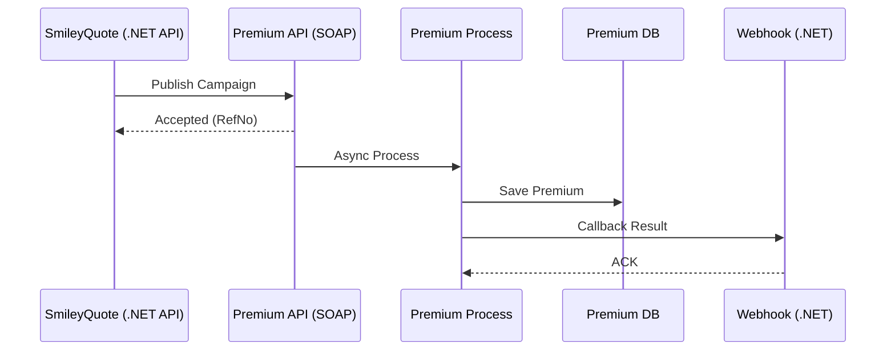

# 01. System Overview

```mermaid
sequenceDiagram
    participant SQ as SmileyQuote (.NET API)
    participant PA as Premium API (SOAP)
    participant PP as Premium Process
    participant DB as Premium DB
    participant WH as Webhook (.NET)

    SQ->>PA: Publish Campaign
    PA-->>SQ: Accepted (RefNo)
    PA->>PP: Async Process
    PP->>DB: Save Premium
    PP->>WH: Callback Result
    WH-->>PP: ACK
```
