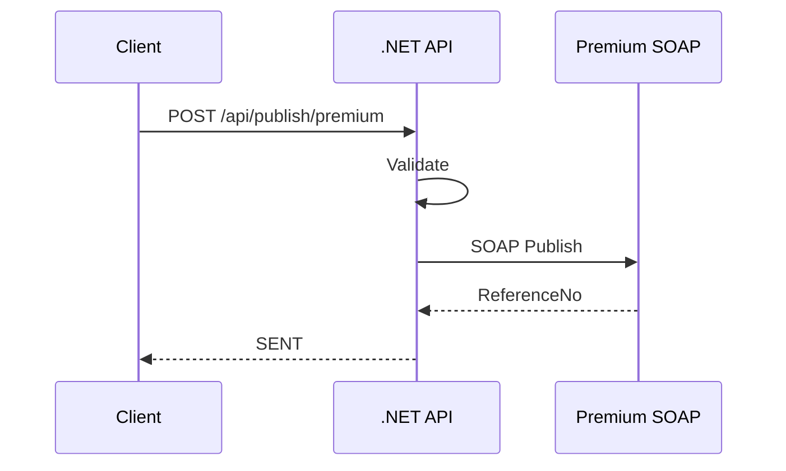

# 02. Publish Campaign Process (.NET → Premium)

```mermaid
sequenceDiagram
    participant Client
    participant API as .NET API
    participant SOAP as Premium SOAP

    Client->>API: POST /api/publish/premium
    API->>API: Validate
    API->>SOAP: SOAP Publish
    SOAP-->>API: ReferenceNo
    API-->>Client: SENT
```
