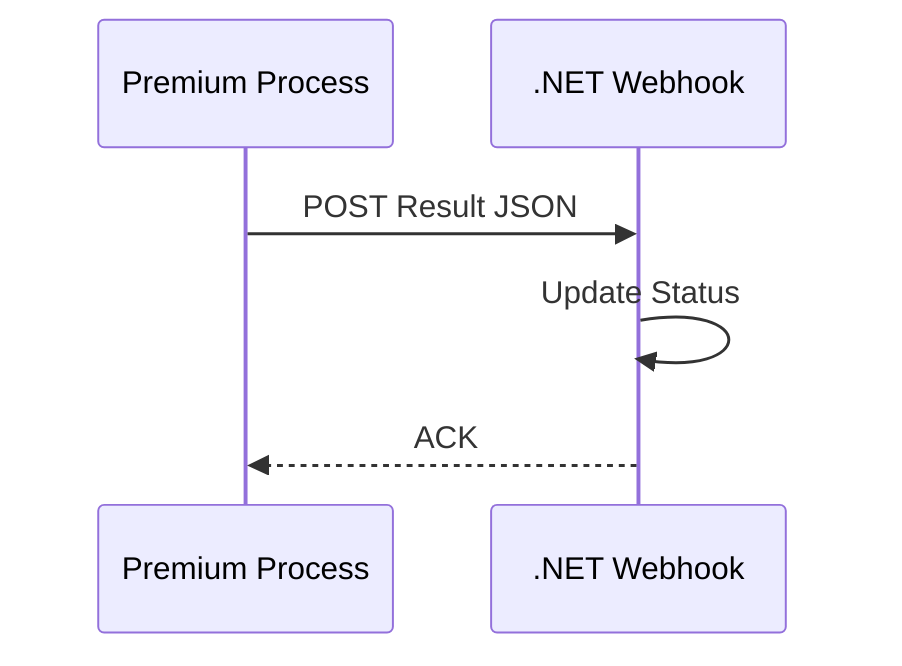

# 07. Callback Webhook Process

```mermaid
sequenceDiagram
    participant P as Premium Process
    participant WH as .NET Webhook

    P->>WH: POST Result JSON
    WH->>WH: Update Status
    WH-->>P: ACK
```
