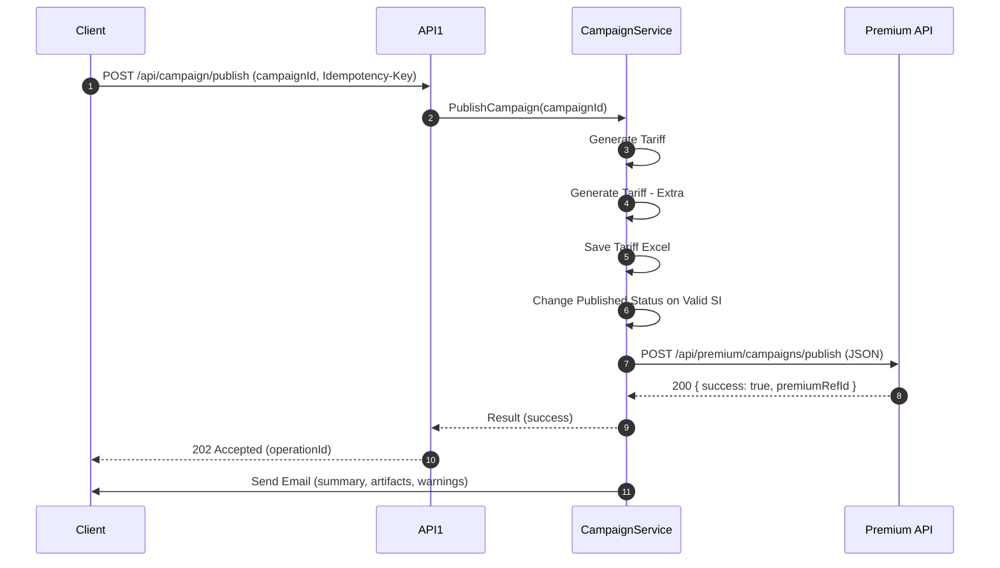

# PublishCampaign → Premium API — Full Technical Spec

*ปรับปรุงล่าสุด: 2026-03-20 03:03:36*

> **วัตถุประสงค์:** รวมทุกข้อมูลและข้อกำหนดที่ได้คุยกันก่อนหน้าไว้ในไฟล์เดียว ตั้งแต่สถาปัตยกรรม/ลำดับงาน, สัญญา API, แนวทางความปลอดภัย/ความทนทาน, ไปจนถึง **ตารางอธิบายฟิลด์ทั้งหมด** และ **JSON Schema** สำหรับ validate payload ที่ส่งไปยัง **Premium API** ในขั้นตอน **Publish To Premium**.

---

## 1) ขอบเขต (Scope)
- ครอบคลุมเส้นทาง **PublishCampaign**: `API1 → Service → Publish To Premium → Premium API` เท่านั้น
- ไม่ครอบคลุมการดูแล SOAP ภายในของ Premium (ถือเป็นระบบ downstream)

---

## 2) สถาปัตยกรรม / ลำดับงาน (Architecture & Workflow)

```
API1 (HttpPost /api/campaign/publish)
  └─> CampaignService.PublishCampaign()
       ├─ Generate Tariff
       ├─ Generate Tariff – Extra
       ├─ Save Tariff Excel (Artifact)
       ├─ Change Published Status on Valid SI
       ├─ Publish To Premium  ──(JSON)──► Premium API
       └─ Send Email (Summary)
```

- **API1**: REST API ที่รับคำสั่ง publish เมื่อแคมเปญถูกยืนยัน
- **Service Layer**: จัดการลำดับงานตามขั้นตอนและประกอบ payload ส่งต่อ
- **Premium API**: ปลายทางรับ JSON เพื่อนำเข้าระบบ Premium (ชั้น SOAP อยู่เบื้องหลัง)

---

## 3) สัญญา API (Contracts)

### 3.1 Inbound — API1 `/api/campaign/publish`
- **Method:** `POST`
- **Headers:** `Content-Type: application/json`, `Authorization: Bearer <token>`, *(แนะนำ)* `Idempotency-Key: <uuid>`
- **Body (อย่างย่อ):**
```json
{
  "campaignId": "CMP-2026-000123",
  "requestedBy": "user@domain.com",
  "note": "Confirmed all steps"
}
```
- **Responses:** `202 Accepted` (async), `400`, `401/403`, `409`, `500`

### 3.2 Outbound — Service → Premium API
- **Method:** `POST`
- **Headers:** `Content-Type: application/json`, `Authorization: Bearer <premium-token>`, `X-Trace-Id: <uuid>`
- **Payload:** โครงสร้างตามส่วน **Payload JSON** และ **JSON Schema** ด้านล่าง (ใช้ชื่อฟิลด์ตรงตามที่กำหนด)

---

## 4) Validation สำคัญ (Key Validations)
- Campaign: วันที่เริ่ม ≤ วันที่สิ้นสุด, สถานะต้องอนุญาต, ไม่ overlap เวอร์ชัน
- Tariff: `MinSI < MaxSI`, ปีรถในช่วงที่อนุญาต, เบี้ย/เปอร์เซ็นต์เป็นค่าถูกต้อง, ความสัมพันธ์ `net = base + extras − discounts` (ถ้ามีการคำนวณฝั่งเรา)
- Artifacts: ไฟล์ Excel ถูกสร้างและเข้าถึงได้
- Idempotency: Key ซ้ำกับ payload เดิมต้องคืนผลเดิม; ถ้า key เดิมแต่ payload ต่าง → `409`

---

## 5) ความทนทาน / Retry / Timeouts
- Outbound: Timeout 10–30s; Retry แบบ **exponential backoff + jitter** เมื่อ 5xx/429/timeout
- จัดเก็บงานล้มเหลวใน **Outbox** ให้ Background Worker รีทราย

---

## 6) Error Handling (สรุป)
| ชั้น | ประเภท | ตัวอย่าง | การตอบกลับ |
|---|---|---|---|
| API1 | Client Error | ขาด `campaignId` | `400` + รายละเอียดฟิลด์ |
| Service | Business | สถานะไม่อนุญาต | ไม่เรียก Premium + log |
| Premium | Validation | `TARIFF_OUT_OF_RANGE` | ส่งข้อความกลับ + แนบในอีเมล |
| Infra | Network | Timeout/5xx | Retry + Outbox + Alert |

---

## 7) Security / Logging / Monitoring
- OAuth2/JWT สำหรับ API1, token แยกสำหรับ Premium; เก็บใน Secret Manager/Key Vault
- บังคับ HTTPS/TLS 1.2+; ไม่ log ข้อมูลอ่อนไหว
- Structured logs พร้อม `traceId`, metrics อัตราสำเร็จ/ล้มเหลว, latency, payload size

---

## 8) Versioning & Environments
- เวอร์ชันผ่าน Header `API-Version: 1` หรือ path `/v1/...`
- DEV/UAT/PROD แยก endpoint/token/artifact ชัดเจน

---

## 9) Sequence Diagram (Mermaid)


---


## 10) ตัวอย่าง Payload JSON (Minimal)


```json
{
  "campaign": {
    "CampaignCode": "CMP-2026-000123",
    "requestedBy": "user@domain.com",
    "requestedAt": "2026-03-20T02:00:00Z"
  },
  "tariffs": [
    {
      "CampaignCode": "CMP-2026-000123",
      "polmst": "MOTOR-PL01",
      "pack": "PACK-A",
      "SClass": "C1",
      "covcod": "OD",
      "Vehgrp": "PVT",
      "vehuse": "PRIVATE",
      "GarageCd": "A1",
      "makdes": "TOYOTA",
      "moddes": "YARIS",
      "cstFlag": "Y",
      "MinCST": 0,
      "MaxCST": 0,
      "MinYear": 2015,
      "MaxYear": 2026,
      "MinSI": 200000,
      "MaxSI": 1200000,
      "DriverName": "SPECIFIC",
      "DrivNo": 2,
      "DrivAge1": 25,
      "DrivAge2": 30,
      "uom6_u": "cc",
      "cctv": "Y",
      "uom1_v": "1500",
      "uom2_v": "AUTO",
      "uom5_v": "SEDAN",
      "Seats41": 3,
      "mv411": 200000,
      "mv412": 200000,
      "mv413": 100000,
      "mv414": 100000,
      "mv42": 50000,
      "mv43": 200000,
      "Dedod": 2000,
      "AdDod": 2000,
      "DedPD": 0,
      "fleet_per": 10,
      "ncbyrs": 3,
      "ncb_per": 30,
      "Dspc_per": 5,
      "loadclm_per": 10,
      "dstfper": 5,
      "baseprm1": 12000,
      "mainPrem": 13500,
      "vehicleUsePrem": 300,
      "enginePrem": 250,
      "driverPrem": 200,
      "vehicleAgePrem": 150,
      "accessoryPrem": 100,
      "siPrem": 400,
      "vehicleGroupPrem": 120,
      "tpbiPersonPrem": 500,
      "tpbiAccPrem": 700,
      "tppdPersonPrem": 800,
      "driver411Prem": 90,
      "passenger412Prem": 120,
      "driver413Prem": 80,
      "passenger414Prem": 110,
      "medicalExp42Prem": 150,
      "bailbond43Prem": 50,
      "deductODPrem": -200,
      "deductADPrem": -100,
      "deductPDPrem": -50,
      "fleet_amt": -300,
      "ncb_amt": -500,
      "Dspc_amt": -200,
      "loadclm_amt": 250,
      "dstfprm": -150,
      "SI22": 0,
      "baseprm3": 0,
      "prem3new": 0,
      "vehicleUse3Prem": 0,
      "engine3Prem": 0,
      "si3Prem": 0,
      "prm_tnew": 14000,
      "prem_net_pd": 13800,
      "adjustAll": -200,
      "prm_stpnew": 3,
      "prm_vatnew": 966,
      "prm_gapnew": 14769,
      "shortRate": 60,
      "day": 200,
      "NetInputGap": 14500,
      "GrossInputGap": 15500,
      "BehaviorLV": "LV1",
      "BehaviorPercent": 10,
      "WallChargeSI": 30000,
      "RateWallCharge": 0.5,
      "NetPremiumWallCharge": 150,
      "GrossPremiumWallCharge": 160,
      "BatteryYear": 2,
      "BatteryPrice": 200000,
      "BatterySI": 200000,
      "RateBattery": 1.2,
      "NetPremiumBattery": 2400,
      "GrossPremiumBattery": 2568,
      "MinEVDrivNo": 1,
      "MaxEVDrivNo": 2,
      "DealerGarageRate": 10,
      "DealerGarageAmount": 500
    }
  ]
}
```


## 11) ตารางฟิลด์ — ระดับ Campaign


| ฟิลด์ | ชนิด | จำเป็น | คำอธิบาย | ตัวอย่าง |
|---|---|---|---|---|
| CampaignCode | string | Yes | รหัสแคมเปญ (อ้างอิงเดียวกับฝั่งระบบแคมเปญ) | CMP-2026-000123 |
| requestedBy | string | Yes | ผู้ร้องขอ (อีเมลหรือรหัสพนักงาน) | user@domain.com |
| requestedAt | string | Yes | เวลาที่ร้องขอตามรูปแบบ ISO-8601 | 2026-03-20T02:00:00Z |


## 12) ตารางฟิลด์ — ระดับ Tariff (หนึ่งแถวต่อหนึ่งชุดอัตรา)


| ฟิลด์ | ชนิด | จำเป็น | คำอธิบาย | ตัวอย่าง |
|---|---|---|---|---|
| CampaignCode | string | Yes | รหัสแคมเปญใช้ผูกกับ tariff แถวนี้ | CMP-2026-000123 |
| polmst | string | Yes | รหัสกรมธรรม์หลัก/ผลิตภัณฑ์ (policy master code) | MOTOR-PL01 |
| pack | string | Yes | ชุดความคุ้มครอง/แพ็คเกจ | PACK-A |
| SClass | string | No | กลุ่มชั้น/ประเภทสินค้า (Sub Class) | C1 |
| covcod | string | No | รหัสความคุ้มครองหลัก (Coverage Code) | OD |
| Vehgrp | string | No | กลุ่มประเภทรถ (Vehicle Group) | PVT |
| vehuse | string | No | การใช้งานรถ (Vehicle Use) | PRIVATE |
| GarageCd | string | No | ประเภทอู่/ศูนย์ (รหัสอู่) | A1 |
| makdes | string | No | ยี่ห้อรถ (Make Description) | TOYOTA |
| moddes | string | No | รุ่นรถ (Model Description) | YARIS |
| cstFlag | string | No | ธงลูกค้า/เงื่อนไขพิเศษ (เช่น Y/N) | Y |
| MinCST | number | No | ค่าลูกค้าขั้นต่ำ/เงื่อนไขขั้นต่ำที่ใช้คำนวณ | 0 |
| MaxCST | number | No | ค่าลูกค้าขั้นสูง/เงื่อนไขขั้นสูงที่ใช้คำนวณ | 0 |
| MinYear | integer | No | ปีรถขั้นต่ำ | 2015 |
| MaxYear | integer | No | ปีรถขั้นสูง | 2026 |
| MinSI | number | No | ทุนประกันขั้นต่ำ (Sum Insured) | 200000 |
| MaxSI | number | No | ทุนประกันขั้นสูง (Sum Insured) | 1200000 |
| DriverName | string | No | ชื่อผู้ขับ/เงื่อนไขชื่อผู้ขับ (ถ้ามี) | SPECIFIC |
| DrivNo | integer | No | จำนวนผู้ขับที่ระบุ | 2 |
| DrivAge1 | integer | No | อายุผู้ขับคนที่ 1 | 25 |
| DrivAge2 | integer | No | อายุผู้ขับคนที่ 2 | 30 |
| uom6_u | string | No | หน่วย/ตัวแปรเสริม (เช่น cc, kW ฯลฯ) | cc |
| cctv | string | No | เงื่อนไขติดตั้งกล้อง (Y/N) | Y |
| uom1_v | string | No | ค่าตัวแปร 1 (เช่น ขนาดเครื่องยนต์) | 1500 |
| uom2_v | string | No | ค่าตัวแปร 2 | AUTO |
| uom5_v | string | No | ค่าตัวแปร 5 | SEDAN |
| Seats41 | integer | No | จำนวนที่นั่งสำหรับความคุ้มครอง 41 (ผู้โดยสาร) | 3 |
| mv411 | number | No | ทุน/วงเงินคุ้มครองรหัส 411 (เช่น คนขับ) | 200000 |
| mv412 | number | No | ทุน/วงเงินคุ้มครองรหัส 412 (ผู้โดยสาร) | 200000 |
| mv413 | number | No | ทุน/วงเงินคุ้มครองรหัส 413 (คนขับ) | 100000 |
| mv414 | number | No | ทุน/วงเงินคุ้มครองรหัส 414 (ผู้โดยสาร) | 100000 |
| mv42 | number | No | ทุน/วงเงินคุ้มครองรหัส 42 (ค่ารักษาพยาบาล) | 50000 |
| mv43 | number | No | ทุน/วงเงินคุ้มครองรหัส 43 (ประกันตัว) | 200000 |
| Dedod | number | No | ค่าเสียหายส่วนแรกความเสียหายต่อรถตนเอง (OD) | 2000 |
| AdDod | number | No | ค่าเสียหายส่วนแรกอุปกรณ์ตกแต่ง (AD) | 2000 |
| DedPD | number | No | ค่าเสียหายส่วนแรกต่อทรัพย์สินบุคคลภายนอก (PD) | 0 |
| fleet_per | number | No | ส่วนลด/เพิ่มสำหรับรถกลุ่ม (Fleet) เป็นร้อยละ 0–100 | 10 |
| ncbyrs | integer | No | จำนวนปีประวัติ NCB | 3 |
| ncb_per | number | No | อัตรา NCB เป็นร้อยละ 0–100 | 30 |
| Dspc_per | number | No | ส่วนลดพิเศษเป็นร้อยละ 0–100 | 5 |
| loadclm_per | number | No | อัตราเพิ่มจากเคลมเป็นร้อยละ 0–100 | 10 |
| dstfper | number | No | ส่วนลดพนักงานเป็นร้อยละ 0–100 | 5 |
| baseprm1 | number | No | เบี้ยพื้นฐานก่อนปรับปัจจัย | 12000 |
| mainPrem | number | No | เบี้ยหลักหลังปรับภาพรวม | 13500 |
| vehicleUsePrem | number | No | เบี้ยตามการใช้งานรถ | 300 |
| enginePrem | number | No | เบี้ยตามขนาด/กำลังเครื่องยนต์ | 250 |
| driverPrem | number | No | เบี้ยตามผู้ขับ/อายุผู้ขับ | 200 |
| vehicleAgePrem | number | No | เบี้ยตามอายุรถ | 150 |
| accessoryPrem | number | No | เบี้ยอุปกรณ์เสริม | 100 |
| siPrem | number | No | เบี้ยตามทุนประกัน (SI) | 400 |
| vehicleGroupPrem | number | No | เบี้ยตามกลุ่มรถ | 120 |
| tpbiPersonPrem | number | No | เบี้ยความรับผิดต่อบุคคลภายนอก (ต่อคน) | 500 |
| tpbiAccPrem | number | No | เบี้ยความรับผิดต่อบุคคลภายนอก (ต่อครั้ง) | 700 |
| tppdPersonPrem | number | No | เบี้ยความเสียหายต่อทรัพย์สินภายนอก | 800 |
| driver411Prem | number | No | เบี้ยความคุ้มครองรหัส 411 (คนขับ) | 90 |
| passenger412Prem | number | No | เบี้ยความคุ้มครองรหัส 412 (ผู้โดยสาร) | 120 |
| driver413Prem | number | No | เบี้ยความคุ้มครองรหัส 413 (คนขับ) | 80 |
| passenger414Prem | number | No | เบี้ยความคุ้มครองรหัส 414 (ผู้โดยสาร) | 110 |
| medicalExp42Prem | number | No | เบี้ยค่ารักษาพยาบาล (รหัส 42) | 150 |
| bailbond43Prem | number | No | เบี้ยประกันตัว (รหัส 43) | 50 |
| deductODPrem | number | No | ผลรวมลดเบี้ยจาก deductible OD | -200 |
| deductADPrem | number | No | ผลรวมลดเบี้ยจาก deductible AD | -100 |
| deductPDPrem | number | No | ผลรวมลดเบี้ยจาก deductible PD | -50 |
| fleet_amt | number | No | จำนวนเงินส่วนลด/เพิ่ม Fleet (บาท) | -300 |
| ncb_amt | number | No | จำนวนเงินส่วนลด NCB (บาท) | -500 |
| Dspc_amt | number | No | จำนวนเงินส่วนลดพิเศษ (บาท) | -200 |
| loadclm_amt | number | No | จำนวนเงินเพิ่มจากเคลม (บาท) | 250 |
| dstfprm | number | No | จำนวนเงินส่วนลดพนักงาน (บาท) | -150 |
| SI22 | number | No | ทุนประกันคุ้มครอง 22 (ถ้ามี) | 0 |
| baseprm3 | number | No | เบี้ยพื้นฐานชุดที่ 3 | 0 |
| prem3new | number | No | เบี้ยคำนวณใหม่ชุดที่ 3 | 0 |
| vehicleUse3Prem | number | No | เบี้ยการใช้งานรถ (สูตรชุด 3) | 0 |
| engine3Prem | number | No | เบี้ยเครื่องยนต์ (สูตรชุด 3) | 0 |
| si3Prem | number | No | เบี้ย SI (สูตรชุด 3) | 0 |
| prm_tnew | number | No | เบี้ยรวมใหม่หลังปรับทั้งหมด | 14000 |
| prem_net_pd | number | No | เบี้ยสุทธิ (ไม่รวมภาษี/อากร) | 13800 |
| adjustAll | number | No | ยอดปรับเพิ่ม/ลดรวมทั้งหมด | -200 |
| prm_stpnew | number | No | อากรแสตมป์ (บาท) | 3 |
| prm_vatnew | number | No | ภาษีมูลค่าเพิ่ม (บาท) | 966 |
| prm_gapnew | number | No | เบี้ยรวมก่อน Short Rate (บาท) | 14769 |
| shortRate | number | No | อัตรา Short Rate เป็นร้อยละ 0–100 | 60 |
| day | integer | No | จำนวนวันคุ้มครอง (ใช้คำนวณ Short Rate) | 200 |
| NetInputGap | number | No | ยอดรับสุทธิจากผู้เอาประกัน (บาท) | 14500 |
| GrossInputGap | number | No | ยอดรับรวม (บาท) | 15500 |
| BehaviorLV | string | No | ระดับพฤติกรรมขับขี่ (เช่น LV1/LV2) | LV1 |
| BehaviorPercent | number | No | ส่วนลด/เพิ่มจากพฤติกรรม เป็นร้อยละ 0–100 | 10 |
| WallChargeSI | number | No | ทุนประกันอุปกรณ์ชาร์จ (Wall Charger) | 30000 |
| RateWallCharge | number | No | อัตรา Wall Charger เป็นร้อยละ 0–100 | 0.5 |
| NetPremiumWallCharge | number | No | เบี้ยสุทธิความคุ้มครอง Wall Charger | 150 |
| GrossPremiumWallCharge | number | No | เบี้ยรวมความคุ้มครอง Wall Charger | 160 |
| BatteryYear | integer | No | อายุแบตเตอรี่ (ปี) | 2 |
| BatteryPrice | number | No | ราคาแบตเตอรี่ (บาท) | 200000 |
| BatterySI | number | No | ทุนประกันแบตเตอรี่ | 200000 |
| RateBattery | number | No | อัตราเบี้ยแบตเตอรี่ เป็นร้อยละ 0–100 | 1.2 |
| NetPremiumBattery | number | No | เบี้ยสุทธิแบตเตอรี่ | 2400 |
| GrossPremiumBattery | number | No | เบี้ยรวมแบตเตอรี่ | 2568 |
| MinEVDrivNo | integer | No | จำนวนผู้ขับขั้นต่ำสำหรับ EV | 1 |
| MaxEVDrivNo | integer | No | จำนวนผู้ขับขั้นสูงสำหรับ EV | 2 |
| DealerGarageRate | number | No | อัตราศูนย์/ดีลเลอร์ซ่อม เป็นร้อยละ 0–100 | 10 |
| DealerGarageAmount | number | No | จำนวนเงินเพิ่มสำหรับศูนย์/ดีลเลอร์ | 500 |


## 13) JSON Schema (draft-07)
ใช้สำหรับ validate payload ก่อนเรียก Premium API


```json
{
  "$schema": "http://json-schema.org/draft-07/schema#",
  "$id": "https://example.com/schemas/publishcampaign-premium.json",
  "title": "PublishCampaign → Premium API Payload",
  "type": "object",
  "additionalProperties": false,
  "properties": {
    "campaign": {
      "type": "object",
      "additionalProperties": false,
      "properties": {
        "CampaignCode": {
          "type": "string"
        },
        "requestedBy": {
          "type": "string"
        },
        "requestedAt": {
          "type": "string",
          "format": "date-time"
        }
      },
      "required": [
        "CampaignCode",
        "requestedBy",
        "requestedAt"
      ]
    },
    "tariffs": {
      "type": "array",
      "items": {
        "type": "object",
        "additionalProperties": false,
        "properties": {
          "CampaignCode": {
            "type": "string"
          },
          "polmst": {
            "type": "string"
          },
          "pack": {
            "type": "string"
          },
          "SClass": {
            "type": "string"
          },
          "covcod": {
            "type": "string"
          },
          "Vehgrp": {
            "type": "string"
          },
          "vehuse": {
            "type": "string"
          },
          "GarageCd": {
            "type": "string"
          },
          "makdes": {
            "type": "string"
          },
          "moddes": {
            "type": "string"
          },
          "cstFlag": {
            "type": "string",
            "enum": [
              "Y",
              "N"
            ]
          },
          "MinCST": {
            "type": "number"
          },
          "MaxCST": {
            "type": "number"
          },
          "MinYear": {
            "type": "integer",
            "minimum": 1900,
            "maximum": 2100
          },
          "MaxYear": {
            "type": "integer",
            "minimum": 1900,
            "maximum": 2100
          },
          "MinSI": {
            "type": "number",
            "minimum": 0
          },
          "MaxSI": {
            "type": "number",
            "minimum": 0
          },
          "DriverName": {
            "type": "string"
          },
          "DrivNo": {
            "type": "integer",
            "minimum": 0
          },
          "DrivAge1": {
            "type": "integer",
            "minimum": 0
          },
          "DrivAge2": {
            "type": "integer",
            "minimum": 0
          },
          "uom6_u": {
            "type": "string"
          },
          "cctv": {
            "type": "string",
            "enum": [
              "Y",
              "N"
            ]
          },
          "uom1_v": {
            "type": "string"
          },
          "uom2_v": {
            "type": "string"
          },
          "uom5_v": {
            "type": "string"
          },
          "Seats41": {
            "type": "integer",
            "minimum": 0
          },
          "mv411": {
            "type": "number",
            "minimum": 0
          },
          "mv412": {
            "type": "number",
            "minimum": 0
          },
          "mv413": {
            "type": "number",
            "minimum": 0
          },
          "mv414": {
            "type": "number",
            "minimum": 0
          },
          "mv42": {
            "type": "number",
            "minimum": 0
          },
          "mv43": {
            "type": "number",
            "minimum": 0
          },
          "Dedod": {
            "type": "number",
            "minimum": 0
          },
          "AdDod": {
            "type": "number",
            "minimum": 0
          },
          "DedPD": {
            "type": "number",
            "minimum": 0
          },
          "fleet_per": {
            "type": "number",
            "minimum": 0,
            "maximum": 100
          },
          "ncbyrs": {
            "type": "integer",
            "minimum": 0
          },
          "ncb_per": {
            "type": "number",
            "minimum": 0,
            "maximum": 100
          },
          "Dspc_per": {
            "type": "number",
            "minimum": 0,
            "maximum": 100
          },
          "loadclm_per": {
            "type": "number",
            "minimum": 0,
            "maximum": 100
          },
          "dstfper": {
            "type": "number",
            "minimum": 0,
            "maximum": 100
          },
          "baseprm1": {
            "type": "number"
          },
          "mainPrem": {
            "type": "number",
            "minimum": 0
          },
          "vehicleUsePrem": {
            "type": "number",
            "minimum": 0
          },
          "enginePrem": {
            "type": "number",
            "minimum": 0
          },
          "driverPrem": {
            "type": "number",
            "minimum": 0
          },
          "vehicleAgePrem": {
            "type": "number",
            "minimum": 0
          },
          "accessoryPrem": {
            "type": "number",
            "minimum": 0
          },
          "siPrem": {
            "type": "number",
            "minimum": 0
          },
          "vehicleGroupPrem": {
            "type": "number",
            "minimum": 0
          },
          "tpbiPersonPrem": {
            "type": "number",
            "minimum": 0
          },
          "tpbiAccPrem": {
            "type": "number",
            "minimum": 0
          },
          "tppdPersonPrem": {
            "type": "number",
            "minimum": 0
          },
          "driver411Prem": {
            "type": "number",
            "minimum": 0
          },
          "passenger412Prem": {
            "type": "number",
            "minimum": 0
          },
          "driver413Prem": {
            "type": "number",
            "minimum": 0
          },
          "passenger414Prem": {
            "type": "number",
            "minimum": 0
          },
          "medicalExp42Prem": {
            "type": "number",
            "minimum": 0
          },
          "bailbond43Prem": {
            "type": "number",
            "minimum": 0
          },
          "deductODPrem": {
            "type": "number",
            "minimum": 0
          },
          "deductADPrem": {
            "type": "number",
            "minimum": 0
          },
          "deductPDPrem": {
            "type": "number",
            "minimum": 0
          },
          "fleet_amt": {
            "type": "number",
            "minimum": 0
          },
          "ncb_amt": {
            "type": "number",
            "minimum": 0
          },
          "Dspc_amt": {
            "type": "number",
            "minimum": 0
          },
          "loadclm_amt": {
            "type": "number",
            "minimum": 0
          },
          "dstfprm": {
            "type": "number"
          },
          "SI22": {
            "type": "number"
          },
          "baseprm3": {
            "type": "number"
          },
          "prem3new": {
            "type": "number"
          },
          "vehicleUse3Prem": {
            "type": "number",
            "minimum": 0
          },
          "engine3Prem": {
            "type": "number",
            "minimum": 0
          },
          "si3Prem": {
            "type": "number",
            "minimum": 0
          },
          "prm_tnew": {
            "type": "number"
          },
          "prem_net_pd": {
            "type": "number"
          },
          "adjustAll": {
            "type": "number"
          },
          "prm_stpnew": {
            "type": "number"
          },
          "prm_vatnew": {
            "type": "number"
          },
          "prm_gapnew": {
            "type": "number"
          },
          "shortRate": {
            "type": "number",
            "minimum": 0,
            "maximum": 100
          },
          "day": {
            "type": "integer",
            "minimum": 0,
            "maximum": 366
          },
          "NetInputGap": {
            "type": "number"
          },
          "GrossInputGap": {
            "type": "number"
          },
          "BehaviorLV": {
            "type": "string"
          },
          "BehaviorPercent": {
            "type": "number",
            "minimum": 0,
            "maximum": 100
          },
          "WallChargeSI": {
            "type": "number",
            "minimum": 0
          },
          "RateWallCharge": {
            "type": "number",
            "minimum": 0,
            "maximum": 100
          },
          "NetPremiumWallCharge": {
            "type": "number"
          },
          "GrossPremiumWallCharge": {
            "type": "number"
          },
          "BatteryYear": {
            "type": "integer",
            "minimum": 1900,
            "maximum": 2100
          },
          "BatteryPrice": {
            "type": "number",
            "minimum": 0
          },
          "BatterySI": {
            "type": "number",
            "minimum": 0
          },
          "RateBattery": {
            "type": "number",
            "minimum": 0,
            "maximum": 100
          },
          "NetPremiumBattery": {
            "type": "number"
          },
          "GrossPremiumBattery": {
            "type": "number"
          },
          "MinEVDrivNo": {
            "type": "integer",
            "minimum": 0
          },
          "MaxEVDrivNo": {
            "type": "integer",
            "minimum": 0
          },
          "DealerGarageRate": {
            "type": "number",
            "minimum": 0,
            "maximum": 100
          },
          "DealerGarageAmount": {
            "type": "number"
          }
        },
        "required": [
          "CampaignCode",
          "polmst",
          "pack"
        ]
      },
      "minItems": 1
    }
  },
  "required": [
    "campaign",
    "tariffs"
  ]
}
```


## 14) แนวทางการใช้งาน
1. ประกอบ payload ให้ตรงตามตารางฟิลด์
2. ตรวจสอบด้วย JSON Schema ก่อนส่ง (ajv/Newtonsoft.Json.Schema/ฯลฯ)
3. ผูก `Idempotency-Key` กับผลลัพธ์เพื่อลดความเสี่ยงการประมวลผลซ้ำ
