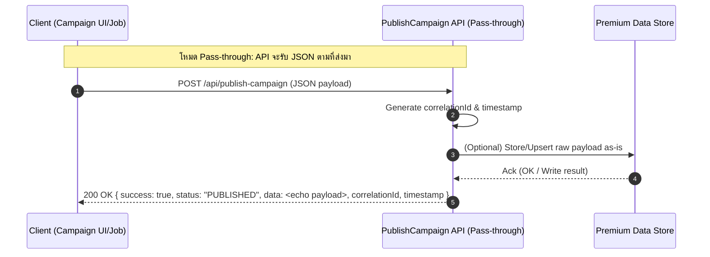

# PublishCampaign API — Full Technical Spec (REST / OpenAPI)

> เอกสารนี้ครอบคลุมเฉพาะ **API PublishCampaign**  พร้อม **Field Dictionary แบบละเอียด**, **API Flow Diagram** 

---

## 1) Overview
API สำหรับรับข้อมูลแคมเปญและองค์ประกอบเบี้ย เพื่อนำไปบันทึก/อัปเดตในระบบ Premium และส่งผลลัพธ์มาตรฐานกลับไปยังผู้เรียก

### API Flow Diagram


---

## 2) Endpoint
- **Method**: `POST`
- **URL**: `/api/publish-campaign`
- **Auth**: `Bearer <JWT>` (แนะนำ) หรือระบบ Auth อื่นตามมาตรฐานองค์กร
- **Content-Type**: `application/json`

### 2.1 Request Example (จากผู้ใช้)
```json
{
  "CompanyCode": "TMSTH",
  "CampaignCode": "C68/00007",
  "polmst": "658-00000001",
  "pack": "T",
  "SClass": "210",
  "covcod": "1",
  "Vehgrp": "",
  "vehuse": "1",
  "GarageCd": "",
  "makdes": "NISSAN",
  "moddes": "URVAN",
  "cstFlag": "S",
  "MinCST": "0",
  "MaxCST": "12",
  "MinYear": "7",
  "MaxYear": "7",
  "MinSI": "400000",
  "MaxSI": "400000",
  "DriverName": "No",
  "DrivNo": "0",
  "DrivAge1": "0",
  "DrivAge2": "0",
  "uom6_u": "",
  "cctv": "No",
  "uom1_v": "500000",
  "uom2_v": "10000000",
  "uom5_v": "1000000",
  "Seats41": "12",
  "mv411": "50000",
  "mv412": "50000",
  "mv413": "0",
  "mv414": "0",
  "mv42": "50000",
  "mv43": "200000",
  "Dedod": "0",
  "AdDod": "0",
  "DedPD": "0",
  "fleet_per": "0.00",
  "ncbyrs": "0.00",
  "ncb_per": "0.00",
  "Dspc_per": "0.00",
  "loadclm_per": "20.00",
  "dstfper": "0.00",
  "baseprm1": "15162.00",
  "mainPrem": "23725.00",
  "vehicleUsePrem": "0.00",
  "enginePrem": "-1819.00",
  "driverPrem": "667.00",
  "vehicleAgePrem": "700.00",
  "accessoryPrem": "0.00",
  "siPrem": "8826.00",
  "vehicleGroupPrem": "0.00",
  "tpbiPersonPrem": "0.00",
  "tpbiAccPrem": "0.00",
  "tppdPersonPrem": "187.00",
  "driver411Prem": "25.00",
  "passenger412Prem": "275.00",
  "driver413Prem": "0.00",
  "passenger414Prem": "0.00",
  "medicalExp42Prem": "3.00",
  "bailbond43Prem": "20.00",
  "deductODPrem": "0.00",
  "deductADPrem": "0.00",
  "deductPDPrem": "0.00",
  "fleet_amt": "0.00",
  "ncb_amt": "0.00",
  "Dspc_amt": "0.00",
  "loadclm_amt": "4810.00",
  "dstfprm": "0.00",
  "SI22": "0",
  "baseprm3": "0.00",
  "prem3new": "0.00",
  "vehicleUse3Prem": "0.00",
  "engine3Prem": "0.00",
  "si3Prem": "0.00",
  "prm_tnew": "28856.00",
  "prem_net_pd": "28856.00",
  "adjustAll": "-1.00",
  "prm_stpnew": "116.00",
  "prm_vatnew": "2028.04",
  "prm_gapnew": "31000.04",
  "shortRate": "No",
  "day": "365",
  "NetInputGap": "0.00",
  "GrossInputGap": "0.00",
  "BehaviorLV": "0",
  "BehaviorPercent": "105",
  "WallChargeSI": "",
  "RateWallCharge": "",
  "NetPremiumWallCharge": "",
  "GrossPremiumWallCharge": "",
  "BatteryYear": "",
  "BatteryPrice": "",
  "BatterySI": "",
  "RateBattery": "",
  "NetPremiumBattery": "",
  "GrossPremiumBattery": "0",
  "MinEVDrivNo": "0",
  "MaxEVDrivNo": "",
  "DealerGarageRate": "0.00",
  "DealerGarageAmount": ""
}
```

### 2.2 Response Examples
**Success 200**
```json
{
  "success": true,
  "campaignCode": "C68/00007",
  "premiumBatchId": "PRM-20260320-0001",
  "recordsAccepted": 1,
  "recordsRejected": 0,
  "warnings": [],
  "timestamp": "2026-03-20T11:03:48+07:00",
  "correlationId": "6f3a9f7e-aaaa-bbbb-cccc-000000000001"
}
```

**Error 400**
```json
{
  "success": false,
  "errorCode": "E4001",
  "errorMessage": "Validation failed",
  "details": [
    {
      "field": "vehuse",
      "issue": "required",
      "value": ""
    },
    {
      "field": "MinSI",
      "issue": "must be <= MaxSI",
      "value": {
        "MinSI": 500000,
        "MaxSI": 400000
      }
    }
  ],
  "recordsAccepted": 0,
  "recordsRejected": 1,
  "timestamp": "2026-03-20T11:03:48+07:00",
  "correlationId": "6f3a9f7e-aaaa-bbbb-cccc-000000000002"
}
```
---

## 3) Field Dictionary (รายละเอียดทุกฟิลด์)
| Field | Type | Required | Example | Description | Constraints |
|---|---|:--:|---|---|---|
| CompanyCode | string | Y | TMSTH | รหัสบริษัท/ผู้รับประกัน | - |
| CampaignCode | string | Y | C68/00007 | รหัสแคมเปญ/เลขที่แคมเปญ | - |
| polmst | string | Y | 658-00000001 | เลขที่กรมธรรม์หลัก (Policy Master) | - |
| pack | string | Y | T | รหัสแพ็กเกจ (Package) | - |
| SClass | integer | Y | 210 | ชั้นประกันภัย | - |
| covcod | integer | Y | 1 | รหัสความคุ้มครอง (Coverage Code) | - |
| Vehgrp | string | N |  | กลุ่มประเภทรถ (Vehicle Group) | - |
| vehuse | integer | Y | 1 | ลักษณะการใช้รถ (Vehicle Use) — รหัส/ตัวเลข | - |
| GarageCd | string | N |  | รหัสอู่/ศูนย์บริการ | - |
| makdes | string | Y | NISSAN | ยี่ห้อรถ (Make) | - |
| moddes | string | Y | URVAN | รุ่นรถ (Model) | - |
| cstFlag | string enum(Yes, No) | N | S | สถานะคิดค่า CST/ค่าธรรมเนียม (Yes/No) | - |
| MinCST | integer | N | 0 | CST ขั้นต่ำ | - |
| MaxCST | integer | N | 12 | CST สูงสุด | - |
| MinYear | integer | N | 7 | อายุรถขั้นต่ำ (ปี) | min=0 |
| MaxYear | integer | N | 7 | อายุรถสูงสุด (ปี) | min=0 |
| MinSI | number | Y | 400000 | ทุนประกันขั้นต่ำ (Sum Insured) | - |
| MaxSI | number | Y | 400000 | ทุนประกันสูงสุด (Sum Insured) | - |
| DriverName | string | N | No | ชื่อผู้ขับขี่หลัก | - |
| DrivNo | integer | N | 0 | จำนวนผู้ขับขี่ที่ระบุ | min=0 |
| DrivAge1 | integer | N | 0 | อายุผู้ขับขั้นต่ำ | min=0 |
| DrivAge2 | integer | N | 0 | อายุผู้ขับสูงสุด | min=0 |
| uom6_u | string | N |  | ค่าหน่วย UOM6 (ต่อหน่วย) | - |
| cctv | string enum(Yes, No) | N | No | ติดตั้งกล้องหน้ารถ (Yes/No) | - |
| uom1_v | integer | N | 500000 | ค่าพารามิเตอร์ UOM1 | - |
| uom2_v | integer | N | 10000000 | ค่าพารามิเตอร์ UOM2 | - |
| uom5_v | integer | N | 1000000 | ค่าพารามิเตอร์ UOM5 | - |
| Seats41 | integer | N | 12 | จำนวนที่นั่งคุ้มครองหมวด 41 | min=0 |
| mv411 | integer | N | 50000 | ทุนคุ้มครองหมวด 411 | - |
| mv412 | integer | N | 50000 | ทุนคุ้มครองหมวด 412 | - |
| mv413 | integer | N | 0 | ทุนคุ้มครองหมวด 413 | - |
| mv414 | integer | N | 0 | ทุนคุ้มครองหมวด 414 | - |
| mv42 | integer | N | 50000 | ทุนค่ารักษาพยาบาล (42) | - |
| mv43 | integer | N | 200000 | ทุนประกันตัวผู้ขับขี่ (43) | - |
| Dedod | integer | N | 0 | Deduct ความเสียหายตนเอง (OD) | - |
| AdDod | integer | N | 0 | ส่วนลด/เพิ่ม Deduct OD เพิ่มเติม | - |
| DedPD | integer | N | 0 | Deduct ความเสียหายทรัพย์สินบุคคลภายนอก (PD) | - |
| fleet_per | number | N | 0.00 | % ส่วนลด/เพิ่ม Fleet | min=-100, max=100 |
| ncbyrs | integer | N | 0.00 | จำนวนปี NCB | min=0 |
| ncb_per | number | N | 0.00 | % NCB | min=-100, max=100 |
| Dspc_per | number | N | 0.00 | % ส่วนลดพิเศษ (Special Discount) | min=-100, max=100 |
| loadclm_per | number | N | 20.00 | % Load ตามประวัติการเคลม | min=-100, max=100 |
| dstfper | number | N | 0.00 | % อื่น ๆ/เทศกาล | - |
| baseprm1 | number | N | 15162.00 | เบี้ยฐาน (Base Premium 1) | - |
| mainPrem | number | N | 23725.00 | เบี้ยหลักหลังปรับ | - |
| vehicleUsePrem | number | N | 0.00 | ส่วนเบี้ยตามการใช้รถ | - |
| enginePrem | number | N | -1819.00 | ส่วนเบี้ยตามขนาดเครื่องยนต์ | - |
| driverPrem | number | N | 667.00 | ส่วนเบี้ยตามผู้ขับ | - |
| vehicleAgePrem | number | N | 700.00 | ส่วนเบี้ยตามอายุรถ | - |
| accessoryPrem | number | N | 0.00 | ส่วนเบี้ยอุปกรณ์ตกแต่ง | - |
| siPrem | number | N | 8826.00 | ส่วนเบี้ยตามทุนประกัน (SI) | - |
| vehicleGroupPrem | number | N | 0.00 | ส่วนเบี้ยตามกลุ่มรถ | - |
| tpbiPersonPrem | number | N | 0.00 | เบี้ยความรับผิดต่อบุคคลภายนอก (BI/คน) | - |
| tpbiAccPrem | number | N | 0.00 | เบี้ยความรับผิดต่อบุคคลภายนอก (BI/ครั้ง) | - |
| tppdPersonPrem | number | N | 187.00 | เบี้ยความเสียหายทรัพย์สินบุคคลภายนอก (PD) | - |
| driver411Prem | number | N | 25.00 | เบี้ยคุ้มครองผู้ขับ (411) | - |
| passenger412Prem | number | N | 275.00 | เบี้ยคุ้มครองผู้โดยสาร (412) | - |
| driver413Prem | number | N | 0.00 | เบี้ยคุ้มครองผู้ขับ (413) | - |
| passenger414Prem | number | N | 0.00 | เบี้ยคุ้มครองผู้โดยสาร (414) | - |
| medicalExp42Prem | number | N | 3.00 | เบี้ยค่ารักษาพยาบาล (42) | - |
| bailbond43Prem | number | N | 20.00 | เบี้ยประกันตัว (43) | - |
| deductODPrem | number | N | 0.00 | ผลรวมผลกระทบ Deduct OD | - |
| deductADPrem | number | N | 0.00 | ผลรวมผลกระทบ Deduct AD | - |
| deductPDPrem | number | N | 0.00 | ผลรวมผลกระทบ Deduct PD | - |
| fleet_amt | number | N | 0.00 | จำนวนเงินลด/เพิ่ม Fleet | - |
| ncb_amt | number | N | 0.00 | จำนวนเงิน NCB | - |
| Dspc_amt | number | N | 0.00 | จำนวนเงินส่วนลดพิเศษ | - |
| loadclm_amt | number | N | 4810.00 | จำนวนเงิน Load ตามเคลม | - |
| dstfprm | number | N | 0.00 | จำนวนเงินปรับอื่น ๆ | - |
| SI22 | integer | N | 0 | ทุนประกัน (Code 22 เฉพาะแคมเปญ) | - |
| baseprm3 | number | N | 0.00 | เบี้ยฐาน 3 | - |
| prem3new | number | N | 0.00 | เบี้ยประเภท 3 ใหม่ | - |
| vehicleUse3Prem | number | N | 0.00 | ส่วนเบี้ยใช้รถ – ประเภท 3 | - |
| engine3Prem | number | N | 0.00 | ส่วนเบี้ยเครื่องยนต์ – ประเภท 3 | - |
| si3Prem | number | N | 0.00 | ส่วนเบี้ยทุน – ประเภท 3 | - |
| prm_tnew | number | N | 28856.00 | เบี้ยรวมใหม่ (Total New Premium) | - |
| prem_net_pd | number | N | 28856.00 | เบี้ยสุทธิหมวดทรัพย์สินบุคคลภายนอก (PD Net) | - |
| adjustAll | number | N | -1.00 | การปรับเบี้ยรวมทั้งหมด | - |
| prm_stpnew | number | N | 116.00 | เบี้ยสุทธิใหม่ | - |
| prm_vatnew | number | N | 2028.04 | ภาษีมูลค่าเพิ่ม | - |
| prm_gapnew | number | N | 31000.04 | ค่า GAP/Stamp ฯลฯ | - |
| shortRate | number | N | No | อัตรา Short Rate (%) | min=0, max=100 |
| day | integer | N | 365 | จำนวนวันคุ้มครอง | min=1, max=366 |
| NetInputGap | number | N | 0.00 | GAP สุทธิที่ป้อน | - |
| GrossInputGap | number | N | 0.00 | GAP รวมที่ป้อน | - |
| BehaviorLV | integer | N | 0 | ระดับพฤติกรรมการขับ | min=0 |
| BehaviorPercent | number | N | 105 | % ส่วนลด/เพิ่มจากพฤติกรรม | min=-100, max=100 |
| WallChargeSI | number | N |  | ทุนคุ้มครองอุปกรณ์ชาร์จติดผนัง (EV) | - |
| RateWallCharge | number | N |  | อัตราเบี้ยอุปกรณ์ชาร์จติดผนัง (%) | min=0, max=100 |
| NetPremiumWallCharge | string | N |  | เบี้ยสุทธิอุปกรณ์ชาร์จ | - |
| GrossPremiumWallCharge | string | N |  | เบี้ยรวมอุปกรณ์ชาร์จ | - |
| BatteryYear | integer | N |  | อายุแบตเตอรี่ (ปี) | min=0 |
| BatteryPrice | string | N |  | ราคาแบตเตอรี่ | - |
| BatterySI | number | N |  | ทุนคุ้มครองแบตเตอรี่ | - |
| RateBattery | number | N |  | อัตราเบี้ยแบตเตอรี่ (%) | min=0, max=100 |
| NetPremiumBattery | string | N |  | เบี้ยสุทธิแบตเตอรี่ | - |
| GrossPremiumBattery | integer | N | 0 | เบี้ยรวมแบตเตอรี่ | - |
| MinEVDrivNo | integer | N | 0 | จำนวนผู้ขับ EV ขั้นต่ำ | min=0 |
| MaxEVDrivNo | integer | N |  | จำนวนผู้ขับ EV สูงสุด | min=0 |
| DealerGarageRate | number | N | 0.00 | อัตราอู่คู่ค้า/ดีลเลอร์ (%) | min=0, max=100 |
| DealerGarageAmount | number | N |  | จำนวนเงินอู่คู่ค้า/ดีลเลอร์ | - |

> *หมายเหตุ*: ฟิลด์บางรายการเป็นรหัสเฉพาะองค์กร โปรดยืนยันค่าที่เป็นไปได้ (Domain/Code List) กับทีมธุรกิจ/กำกับดูแลผลิตภัณฑ์ เพื่อกำหนด Enum/Pattern เพิ่มเติมใน OpenAPI

---

## 4) Error Model
- โครงสร้าง: `success=false`, `errorCode`, `errorMessage`, `details[]` (ประกอบด้วย `field`, `issue`, `value`)
- ตัวอย่างรหัส:
  - `E4001` – Validation failed
  - `E4010` – Authentication failed
  - `E5000` – Internal server error

---


เวอร์ชันเอกสาร: 1.1 — วันที่ 20 Mar 2026


