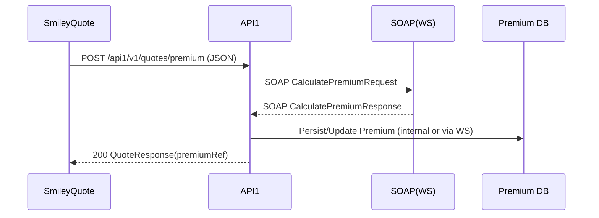
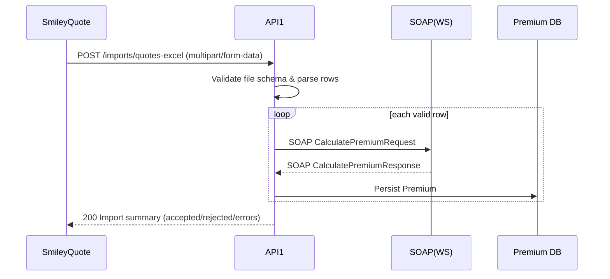

# สเปคการเชื่อมต่อระบบ (Markdown Spec) — **เวอร์ชัน 1.1**

> วันที่อัปเดต: 2026-03-18 • ผู้อัปเดต: M365 Copilot

เอกสารฉบับนี้ปรับปรุงจากเวอร์ชัน 1.0 ให้สอดคล้องกับ **โฟลว์ใหม่** ตามแผนภาพล่าสุด ซึ่งตัด `API2 (SafeSmart)` ออก และเพิ่มความสามารถ **รับไฟล์ Excel จาก SmileyQuote เพื่ออ่าน/ประมวลผลใน API1** จากนั้น API1 เรียก **SOAP (WS)** เพื่อทำงานกับ **Premium DB**

---

## 1) ภาพรวมสถาปัตยกรรม (ตามภาพใหม่)

```
SmileyQuote ───────────────► API1 ─────────► SOAP(WS) ─────────► Premium(DB)
     │                          ▲                                        │
     └─► [Upload Excel] ────────┘                                        └───► API1 (อ่าน/ดึงข้อมูล)
```

- **SmileyQuote → API1**: เรียกใช้งานปกติ (REST) และ **อัปโหลดไฟล์ Excel** เพื่อให้ API1 อ่านข้อมูลเป็น batch
- **API1 → SOAP(WS) → Premium DB**: API1 แปลงคำขอเป็น SOAP เพื่อคำนวณ/บันทึก/อ่านข้อมูลจาก Premium
- **Premium DB → API1**: API1 สามารถอ่านข้อมูลย้อนหลัง/ตรวจสอบสถานะจาก Premium

> หมายเหตุ: โครงสร้างนี้มุ่งให้ API1 เป็นตัวกลางหลัก (orchestrator) ระหว่าง Frontend และระบบ Premium ผ่าน SOAP

---

## 2) บทบาทของคอมโพเนนต์

| คอมโพเนนต์ | บทบาท | โปรโตคอล |
|---|---|---|
| SmileyQuote | ต้นทางในการส่งคำขอ/อัปโหลด Excel | HTTPS/REST + multipart/form-data |
| API1 | Orchestration + Validation + Mapping (REST → SOAP) | HTTPS/REST → SOAP |
| SOAP (WS) | บริการเว็บเซอร์วิสของ Premium | SOAP 1.1/1.2 over HTTPS |
| Premium DB | ฐานข้อมูลเบี้ย/กรมธรรม์ | – |

---

## 3) แบบข้อมูลมาตรฐาน (Canonical Models)

> ยังคงใช้โมเดล `QuoteRequest`/`QuoteResponse` จาก v1.0 และ **เพิ่มสคีมา Excel** สำหรับการนำเข้าข้อมูลเป็นชุด

### 3.1 QuoteRequest (REST JSON)
```json
{
  "requestId": "UUID",
  "quoteNo": "string",
  "productCode": "string",
  "insured": {
    "fullName": "string",
    "dob": "YYYY-MM-DD",
    "nationalId": "string"
  },
  "coverage": {
    "plan": "string",
    "sumInsured": 500000,
    "addons": ["PA", "Flood"]
  },
  "channel": "WEB|AGENT|API",
  "timestamp": "ISO-8601",
  "idempotencyKey": "UUID"
}
```

### 3.2 QuoteResponse
```json
{
  "requestId": "UUID",
  "status": "SUCCESS|FAILED|PENDING",
  "premium": { "gross": 12000.5, "net": 11000.0, "tax": 770.5 },
  "message": "string",
  "reference": { "premiumRef": "string" }
}
```

### 3.3 รูปแบบไฟล์ Excel สำหรับอัปโหลด (ตัวอย่างคอลัมน์)
```
Sheet: Quotes
- RequestId (UUID) [จำเป็น]
- QuoteNo (string)
- ProductCode (string)
- InsuredFullName (string)
- InsuredDOB (YYYY-MM-DD)
- NationalId (string)
- Plan (string)
- SumInsured (number)
- Addons (comma-separated)
```
> แนะนำให้รองรับทั้ง `.xlsx` และ `.xls` โดยยืนยัน schema ก่อนประมวลผล หากพบคอลัมน์หาย/ชนิดข้อมูลผิด ให้รายงานเป็น **รายการ error ต่อแถว**

### 3.4 Premium SOAP Payload (ย่อ)
```xml
<soapenv:Envelope xmlns:soapenv="http://schemas.xmlsoap.org/soap/envelope/" xmlns:pre="http://premium.example.com/schema">
  <soapenv:Header/>
  <soapenv:Body>
    <pre:CalculatePremiumRequest>
      <pre:QuoteNo>string</pre:QuoteNo>
      <pre:ProductCode>string</pre:ProductCode>
      <pre:SumInsured>500000</pre:SumInsured>
      <!-- ... -->
    </pre:CalculatePremiumRequest>
  </soapenv:Body>
</soapenv:Envelope>
```

---

## 4) สัญญา API (เวอร์ชันใหม่)

### 4.1 API1
- **Base URL**: `https://api.company.com/api1/v1`
- **Security**: OAuth2 Client Credentials (scope: `premium:write premium:read`), `Idempotency-Key`

#### 4.1.1 POST `/quotes/premium`
- **Purpose**: รับคำขอคำนวณ/บันทึกเบี้ยเป็นรายรายการ → เรียก SOAP → จัดเก็บ/รับอ้างอิงจาก Premium
- **Headers**: `Authorization`, `Content-Type: application/json`, `Idempotency-Key`
- **Request**: `QuoteRequest`
- **Response**: `QuoteResponse`

#### 4.1.2 **POST** `/imports/quotes-excel`
- **Purpose**: รับไฟล์ Excel เพื่อทำ batch quote/premium
- **Headers**: `Authorization`, `Content-Type: multipart/form-data`
- **Form fields**:
  - `file`: `.xlsx`/`.xls` (สูงสุด 5–20 MB ตามนโยบาย)
  - `mappingProfile` (optional): JSON สำหรับ map ชื่อคอลัมน์ → ฟิลด์มาตรฐาน
  - `idempotencyKey` (header): ใช้กันทำซ้ำ
- **Response (ตัวอย่าง)**:
```json
{
  "importId": "UUID",
  "totalRows": 120,
  "accepted": 115,
  "rejected": 5,
  "errors": [
    {"row": 4, "code": "DOB_FORMAT", "message": "Invalid date"}
  ],
  "status": "PROCESSING|COMPLETED|FAILED"
}
```
> อาจรองรับโหมด **async**: ตอบ `202 Accepted` พร้อม `importId` และมี `GET /imports/{importId}` เพื่อติดตามสถานะ

#### 4.1.3 **GET** `/premium/{premiumRef}`
- **Purpose**: อ่านรายละเอียดเบี้ย/สถานะจาก Premium DB ผ่าน API1

---

## 5) ลำดับการทำงาน (Sequence) ตามโฟลว์ใหม่

### 5.1 รายรายการ (REST JSON)


### 5.2 แบบอัปโหลด Excel (Batch)


---

## 6) การแม็ปข้อมูลและการอ่าน Excel

- รองรับ **mappingProfile** เพื่อ map คอลัมน์ (เช่น `InsuredFullName` → `insured.fullName`)
- ตรวจสอบชนิดข้อมูล: วันที่ (`YYYY-MM-DD`), จำนวนเงิน (`number > 0`), รหัสผลิตภัณฑ์ (`enum`)
- การแบ่งงาน: หากไฟล์ใหญ่ แนะนำแบ่งเป็น **chunk** (เช่น 1,000 แถวต่อ batch) และประมวลผลแบบ async/คิว

---

## 7) ความปลอดภัย
- TLS 1.2+
- OAuth2 Client Credentials + scope
- **Idempotency-Key** สำหรับ POST ทั้งรายรายการและอัปโหลด
- PII masking ใน log, และเข้ารหัส at-rest สำหรับไฟล์อัปโหลดชั่วคราว

---

## 8) การจัดการข้อผิดพลาด

รูปแบบ error สำหรับการอัปโหลด Excel (ตัวอย่าง):
```json
{
  "errorCode": "EXCEL-SCHEMA-001",
  "errorMessage": "Missing required column: SumInsured",
  "row": 2,
  "suggestion": "Add column or update mappingProfile"
}
```

HTTP status guideline: 400 (schema/validation), 409 (idempotency conflict), 413 (payload too large), 415 (unsupported media), 500/502/503/504 (upstream/system)

---

## 9) ไม่ใช่เชิงหน้าที่ (NFR)
- Performance: รายการเดี่ยว P95 ≤ 800ms (ไม่รวม SOAP), Batch 1,000 แถวเสร็จภายใน 5–10 นาที (async)
- Observability: Metrics (success/error per row), tracing ด้วย Correlation-Id ต่อ importId
- Storage: พื้นที่ไฟล์ชั่วคราวลบภายใน 24 ชม.

---

## 10) ตัวอย่างคำสั่งทดสอบ

### 10.1 รายการเดี่ยว
```bash
curl -X POST https://api.company.com/api1/v1/quotes/premium \
  -H "Authorization: Bearer $TOKEN" \
  -H "Content-Type: application/json" \
  -H "Idempotency-Key: $(uuidgen)" \
  -d '{
    "requestId":"11111111-1111-1111-1111-111111111111",
    "quoteNo":"Q24001",
    "productCode":"AUTO_A",
    "insured":{"fullName":"A B","dob":"1993-01-01","nationalId":"1234567890123"},
    "coverage":{"plan":"STD","sumInsured":500000,"addons":["PA"]},
    "channel":"WEB",
    "timestamp":"2026-03-18T03:49:00Z",
    "idempotencyKey":"22222222-2222-2222-2222-222222222222"
  }'
```

### 10.2 อัปโหลด Excel (multipart/form-data)
```bash
curl -X POST https://api.company.com/api1/v1/imports/quotes-excel \
  -H "Authorization: Bearer $TOKEN" \
  -H "Idempotency-Key: $(uuidgen)" \
  -F "file=@quotes.xlsx" \
  -F 'mappingProfile={"InsuredFullName":"insured.fullName","InsuredDOB":"insured.dob"};type=application/json'
```

---

## ภาคผนวก A: Template Data Dictionary (อัปเดตสำหรับ Excel)

| คอลัมน์ | ชนิด | ตัวอย่าง | บังคับ |
|---|---|---|---|
| RequestId | UUID | 11111111-1111-1111-1111-111111111111 | Yes |
| QuoteNo | string | Q24001 | Yes |
| ProductCode | string | AUTO_A | Yes |
| InsuredDOB | date | 1993-01-01 | Yes |
| SumInsured | number | 500000 | Yes |
| Addons | string (CSV) | PA,Flood | No |

---

**หมายเหตุ**: เส้นทาง/ชื่อฟิลด์เป็นร่างเพื่อการสื่อสาร สอดคล้องกับภาพโฟลว์ใหม่ โปรดยืนยันกับทีมเจ้าของระบบก่อนนำไปพัฒนาในแต่ละสภาพแวดล้อม
