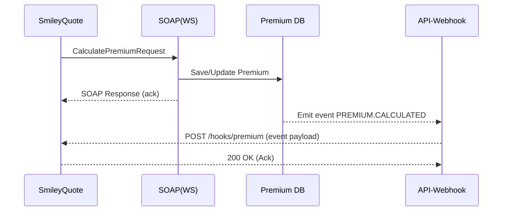
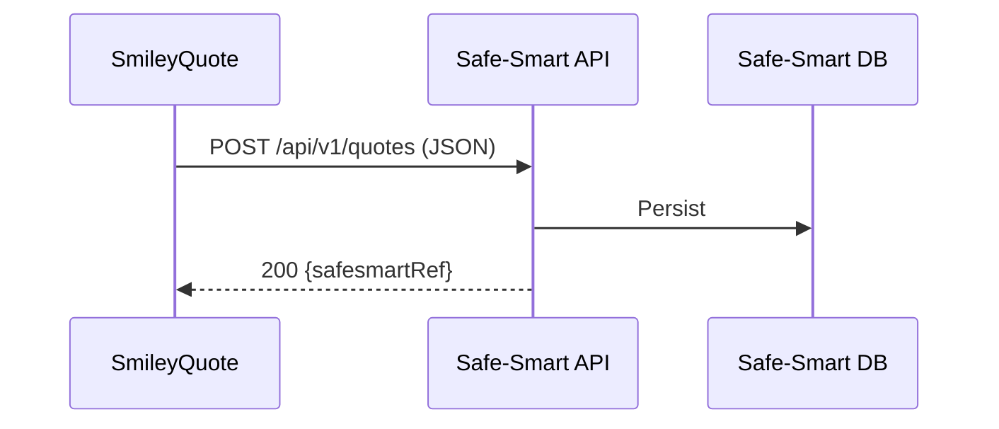

# สเปคการเชื่อมต่อระบบ (Markdown Spec) — **เวอร์ชัน 1.2 (รองรับ Webhook)**

> วันที่อัปเดต: 2026-03-18 • ผู้อัปเดต: M365 Copilot

เอกสารนี้อัปเดตสอดคล้องกับโฟลว์ใหม่ในภาพล่าสุด ซึ่งประกอบด้วย:
- **SmileyQuote** (ต้นทาง)
- **SOAP → Premium DB** (โดเมน Premium อยู่ในกรอบเดียวกัน)
- **API - Webhook** (สำหรับแจ้งผล/อีเวนต์จาก Premium ไปหา SmileyQuote)
- **API → Safe‑Smart** (SmileyQuote เรียกตรง)

---

## 1) ภาพรวมสถาปัตยกรรม

```
SmileyQuote ──► SOAP(WS) ──► Premium DB
     │                         │
     │                         └──► API‑Webhook ──► (callback) ──► SmileyQuote
     └────────────────────────────────────────► API (Safe‑Smart) ──► Safe‑Smart DB
```

- **เส้นทางไป Premium**: SmileyQuote เรียก SOAP เพื่อคำนวน/บันทึกผลใน **Premium DB**
- **ผลลัพธ์/อีเวนต์จาก Premium**: ถูกผลัก (push) ออกทาง **API‑Webhook** กลับมาที่ SmileyQuote (callback URL)
- **เส้นทางไป Safe‑Smart**: SmileyQuote เรียก **API** ของระบบ Safe‑Smart โดยตรง (ไม่ผ่าน API1)

---

## 2) คอมโพเนนต์และบทบาท

| คอมโพเนนต์ | บทบาท | โปรโตคอล |
|---|---|---|
| SmileyQuote | Frontend/Client ต้นทาง, รับ callback จาก Webhook | HTTPS/REST |
| SOAP (WS) | บริการเบื้องหลังของ Premium | SOAP 1.1/1.2 over HTTPS |
| Premium DB | ฐานข้อมูลเบี้ย/กรมธรรม์ของ Premium | – |
| API‑Webhook | บริการกลางของโดเมน Premium สำหรับ push อีเวนต์ | HTTPS/REST (Webhook) |
| API (Safe‑Smart) | บริการ REST ของ Safe‑Smart | HTTPS/REST |

---

## 3) สัญญา Webhook

### 3.1 การลงทะเบียน Webhook (Outbound จาก Premium → SmileyQuote)
- **Endpoint (ของ Premium)**: `POST https://premium.example.com/webhooks/registrations`
- **Headers**: `Authorization: Bearer <token>`
- **Request Body**
```json
{
  "callbackUrl": "https://smileyquote.example.com/hooks/premium",
  "events": ["PREMIUM.CALCULATED", "POLICY.ISSUED", "PREMIUM.FAILED"],
  "secret": "<shared-secret>",
  "retryPolicy": {"max": 5, "backoff": "EXPONENTIAL"}
}
```
- **Response**: `201 Created`
```json
{"webhookId": "UUID", "status": "ACTIVE"}
```

> **Security**: ใช้ `HMAC-SHA256` ลงนาม header `X-Signature: sha256=<hexdigest>` โดยใช้ `secret` เดียวกับที่ลงทะเบียน

### 3.2 โครงสร้าง Callback จาก API‑Webhook → SmileyQuote
- **Method**: `POST`
- **Headers**: `Content-Type: application/json`, `X-Event-Type`, `X-Delivery-Id`, `X-Signature`
- **Payload** (ตัวอย่าง `PREMIUM.CALCULATED`)
```json
{
  "eventType": "PREMIUM.CALCULATED",
  "deliveryId": "UUID",
  "occurredAt": "2026-03-18T03:55:00Z",
  "data": {
    "quoteNo": "Q24001",
    "premiumRef": "PRM-000123",
    "premium": {"gross": 12000.5, "net": 11000.0, "tax": 770.5},
    "status": "SUCCESS"
  }
}
```
- **การยืนยันการรับ (Ack)**: SmileyQuote ต้องตอบ `2xx` ภายใน 5 วินาที หากไม่สำเร็จ ระบบจะ **retry** ตาม `retryPolicy`
- **Idempotency**: ใช้ `X-Delivery-Id` ตรวจการซ้ำที่ฝั่ง SmileyQuote

### 3.3 อีเวนต์มาตรฐาน
- `PREMIUM.CALCULATED` — คำนวณเบี้ยสำเร็จ
- `PREMIUM.FAILED` — คำนวณเบี้ยล้มเหลว พร้อมสาเหตุ
- `POLICY.ISSUED` — ออกกรมธรรม์สำเร็จ

---

## 4) สัญญา SOAP (SmileyQuote → Premium)
> ใช้จากเวอร์ชันก่อนหน้า โดยโฟกัสคำขอคำนวณเบี้ย/ออกกรมธรรม์

**CalculatePremiumRequest (ย่อ)**
```xml
<soapenv:Envelope xmlns:soapenv="http://schemas.xmlsoap.org/soap/envelope/" xmlns:pre="http://premium.example.com/schema">
  <soapenv:Header/>
  <soapenv:Body>
    <pre:CalculatePremiumRequest>
      <pre:QuoteNo>Q24001</pre:QuoteNo>
      <pre:ProductCode>AUTO_A</pre:ProductCode>
      <pre:SumInsured>500000</pre:SumInsured>
      <!-- ... -->
    </pre:CalculatePremiumRequest>
  </soapenv:Body>
</soapenv:Envelope>
```

> ค่าที่ตอบกลับจะถูกบันทึกลง **Premium DB** และอีเวนต์ถูก push ออกด้วย Webhook ตามหัวข้อ 3

---

## 5) สัญญา API ของ Safe‑Smart (SmileyQuote → Safe‑Smart)

- **Base URL**: `https://safesmart.example.com/api/v1`
- **Security**: OAuth2 Client Credentials (scopes: `quote:write quote:read`)

### 5.1 POST `/quotes`
- **Purpose**: ส่งใบเสนอ/ข้อมูลลูกค้าไปยัง Safe‑Smart
- **Request** (ตัวอย่าง)
```json
{
  "quoteNo": "Q24001",
  "productCode": "AUTO_A",
  "insured": {"fullName": "A B", "dob": "1993-01-01"},
  "premiumRef": "PRM-000123"
}
```
- **Response**
```json
{"safesmartRef": "SS-987654", "status": "RECEIVED"}
```

### 5.2 GET `/quotes/{safesmartRef}`
- **Purpose**: ตรวจสอบสถานะใน Safe‑Smart

---

## 6) ลำดับการทำงาน (Sequence)

### 6.1 คำนวณเบี้ยด้วย SOAP + แจ้งผลผ่าน Webhook


### 6.2 ส่งข้อมูลไป Safe‑Smart โดยตรง


---

## 7) ความปลอดภัยและความน่าเชื่อถือ
- **Transport**: TLS 1.2+
- **Auth**: OAuth2 (สำหรับ Safe‑Smart และ Registration ของ Webhook), mTLS (ถ้าองค์กรกำหนด)
- **Webhook Signing**: `HMAC-SHA256` ด้วย shared secret, ตรวจ `X-Signature` ที่ SmileyQuote
- **Idempotency**: ใช้ `X-Delivery-Id` ที่ webhook; สำหรับ POST ไป Safe‑Smart ใช้ header `Idempotency-Key`
- **Retry**: Exponential backoff 1s/2s/4s/8s (สูงสุด 4 ครั้ง) สำหรับ webhook ที่ได้ non‑2xx
- **Dead‑letter**: กรณีส่งไม่สำเร็จหลังครบจำนวนครั้ง ให้เก็บลงคิว DLQ เพื่อ manual replay

---

## 8) การจัดการข้อผิดพลาด (ตัวอย่าง)

### 8.1 Webhook Delivery Error (SmileyQuote ไม่ตอบ)
```json
{
  "deliveryId": "UUID",
  "status": "FAILED",
  "attempts": 4,
  "lastError": "HTTP 503 Service Unavailable"
}
```

### 8.2 Safe‑Smart API Error
- `409 Conflict`: ซ้ำจาก `Idempotency-Key`
- `422 Unprocessable`: โครงสร้างข้อมูลไม่ผ่านธุรกิจ

---

## 9) ไม่ใช่เชิงหน้าที่ (NFR)
- **Latency Webhook**: P95 ≤ 2 วินาทีจากเวลาที่ Premium DB commit → จนถึง SmileyQuote รับอีเวนต์
- **Durability**: เก็บ event log ≥ 7 วัน เพื่อรองรับการ replay
- **Observability**: Trace/Log ด้วย `correlationId` เดียวกันระหว่าง SOAP, Premium, และ Webhook

---

## 10) ตัวอย่าง (Samples)

### 10.1 ตัวอย่าง Signature ตรวจสอบที่ SmileyQuote (แนวคิด)
```pseudo
signature = 'sha256=' + hex(HMAC_SHA256(secret, requestBody))
if request.headers['X-Signature'] != signature: reject(401)
```

### 10.2 ตัวอย่าง cURL ทดสอบ Webhook (ส่งจาก API‑Webhook ไป SmileyQuote)
```bash
curl -X POST https://smileyquote.example.com/hooks/premium \
  -H 'Content-Type: application/json' \
  -H 'X-Event-Type: PREMIUM.CALCULATED' \
  -H 'X-Delivery-Id: 11111111-1111-1111-1111-111111111111' \
  -H 'X-Signature: sha256=<hexdigest>' \
  -d '{
    "eventType":"PREMIUM.CALCULATED",
    "deliveryId":"11111111-1111-1111-1111-111111111111",
    "occurredAt":"2026-03-18T03:55:00Z",
    "data":{"quoteNo":"Q24001","premiumRef":"PRM-000123","premium":{"gross":12000.5,"net":11000,"tax":770.5}}
  }'
```

---

## ภาคผนวก A: แคตตาล็อกอีเวนต์ (ขยายได้)

| Event | คำอธิบาย | Payload หลัก |
|---|---|---|
| PREMIUM.CALCULATED | คำนวณเบี้ยสำเร็จ | `quoteNo`, `premiumRef`, `premium` |
| PREMIUM.FAILED | คำนวณเบี้ยล้มเหลว | `quoteNo`, `errorCode`, `errorMessage` |
| POLICY.ISSUED | ออกกรมธรรม์สำเร็จ | `policyNo`, `premiumRef` |

---

**หมายเหตุ**: URL และสคีมาบางส่วนเป็นร่างเพื่อการสื่อสาร ควรยืนยันร่วมกับทีม Premium/Safe‑Smart ก่อนใช้งานจริง
