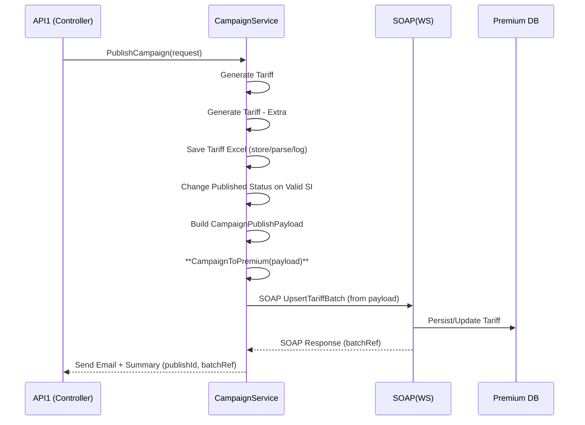

# สเปคการเชื่อมต่อระบบ (Markdown Spec)

**เวอร์ชัน 1.3.2 — อัปเดตตาม Flow ล่าสุด (CampaignToPremium แยกเมธอด + Import Excel)**  
วันที่อัปเดต: 2026-03-18

---

## 0) สาระสำคัญที่เปลี่ยนแปลงจาก v1.3.2 เดิม
จากแผนภาพใหม่ มีการ **แยกเมธอด `CampaignToPremium` ออกจากลูปบริการหลักเป็นเมธอดใหม่** ภายใต้ `CampaignService` และย้ำว่า **เมธอดนี้รับ `Import Excel` โดยตรง** (ข้อมูลที่ถูก parse/validate แล้วจากขั้นตอนก่อนหน้า) เพื่อนำไป **ประกอบ JSON → แปลงเป็น SOAP(WS) → บันทึกเข้า Premium**

สรุปจุดเปลี่ยน:
1. `CampaignToPremium` ถูกเน้นให้เป็น **เมธอดใหม่** ที่สามารถเรียกซ้ำ/อิสระจากขั้นตอนก่อนหน้า เพื่อรองรับ replay / partial publish
2. Interface ระหว่าง **ขั้น Save/Validate** กับ **CampaignToPremium** ชัดเจนขึ้น: ส่งเป็น **`CampaignPublishPayload`** (ดูหัวข้อ 3.3)
3. Flow การเรียกใช้งาน: `API1.HttpPost PublishCampaign (CampaignController)` → เรียก `PublishCampaign (CampaignService)` → ภายในเรียกเมธอดย่อย (Generate/Save/Validate) → **เรียก `CampaignToPremium(payload)`** → SOAP (WS) → Premium

---

## 1) ภาพรวมสถาปัตยกรรม (ตามภาพล่าสุด)

```
API1
└─ HttpPost PublishCampaign (CampaignController)
      └─ Method: PublishCampaign (CampaignService)
            ├─ Generate Tariff
            ├─ Generate Tariff - Extra
            ├─ Save Tariff Excel
            ├─ Change Published Status on Valid SI
            ├─ Campaign To Premium   <── New method can accept Import Excel payload
            └─ Send Email

Campaign To Premium (CampaignService) ──► SOAP(WS) ──► Premium DB
```

**หมายเหตุ:** ลูกศร "Import Excel" ในภาพชี้เข้าที่ `Campaign To Premium` เพื่อย้ำว่าเมธอดนี้สามารถรับข้อมูลจากไฟล์ Excel (ที่ผ่านการ parse/validate แล้ว) โดยตรงได้

---

## 2) Endpoints & Contracts (คงเดิม + เพิ่มระบุอินเตอร์เฟซใหม่)

### 2.1 Public API (จาก WebFront SmileyQuote)
- **POST** `/campaigns/publish`  
  *Controller:* `CampaignController.HttpPost PublishCampaign`  
  *Purpose:* เริ่มต้นกระบวนการ publish โดยส่ง metadata + ตัวชี้ไฟล์ Excel (หรือแนบไฟล์)

ตัวอย่างคำขอ (Form หรือ JSON):
```json
{
  "campaignMeta": {
    "name": "Motor Summer 2026",
    "period": {"from": "2026-04-01", "to": "2026-06-30"},
    "channel": "WEB"
  },
  "excelRef": "IMP-123456" 
}
```

### 2.2 Internal Boundary: Controller → Service
- **Method:** `PublishCampaign(request)`  
  ทำหน้าที่ orchestration: อ่าน/validate excel → แปลงเป็น payload → เรียกเมธอดย่อย (Generate/Extra/Save/Validate) → **เรียก `CampaignToPremium(payload)`** → ส่งอีเมลผลลัพธ์

### 2.3 New Explicit Method: `CampaignToPremium(payload)`
- **Owner:** `CampaignService`
- **Purpose:** รับ payload ที่ได้จากขั้นตอนก่อนหน้า (หรือจาก import ที่เตรียมไว้) → สร้าง canonical JSON → map เป็น SOAP → เรียก WS เพื่อบันทึกเข้า Premium
- **Idempotency:** รับ `batchRef` หรือ `idempotencyKey` เพื่อ replay ได้อย่างปลอดภัย

---

## 3) Data Contracts

### 3.1 Excel Schema (ไม่เปลี่ยนจาก v1.3.2)
**Sheet: Tariff**
```
TariffCode*, ProductCode*, Plan, Coverage, SI_Min*, SI_Max*, RateType*, RateValue*, EffectiveFrom*, EffectiveTo*, Channel, Remark
```
**Sheet: TariffExtra**
```
TariffCode*, ExtraType*, ExtraValue*, Condition, Remark
```

### 3.2 Canonical Models (ย่อ)
```json
{
  "campaign": {
    "name": "Motor Summer 2026",
    "period": {"from": "2026-04-01", "to": "2026-06-30"},
    "channel": "WEB"
  },
  "items": [
    {
      "tariffCode": "TAR-001",
      "productCode": "AUTO_A",
      "plan": "STD",
      "coverage": "OD",
      "si": {"min": 300000, "max": 800000},
      "rate": {"type": "PERCENT", "value": 1.75},
      "effective": {"from": "2026-04-01", "to": "2026-06-30"},
      "extras": [ {"type": "DISCOUNT", "value": 5, "condition": "AGE>30"} ]
    }
  ]
}
```

### 3.3 **ใหม่:** `CampaignPublishPayload` (อินพุตให้ `CampaignToPremium`)
```json
{
  "correlationId": "UUID",
  "batchRef": "UUID | null",           
  "campaign": {
    "name": "Motor Summer 2026",
    "period": {"from": "2026-04-01", "to": "2026-06-30"},
    "channel": "WEB"
  },
  "tariffs": [ { /* TariffItem... */ } ],
  "extras":  [ { /* TariffExtra... */ } ],
  "source": {
    "type": "EXCEL|JSON|DB",
    "excelRef": "IMP-123456",
    "excelFilePath": "/storage/campaign/tmp/IMP-123456/tariff.xlsx"
  },
  "idempotencyKey": "UUID"
}
```
> `CampaignToPremium` จะยอมรับ payload นี้โดยตรง (จาก flow import excel หรือจาก DB) โดยไม่ต้องอ่านไฟล์ซ้ำ หากฟิลด์ `tariffs/extras` ถูกเติมมาแล้ว

---

## 4) ลำดับการทำงาน (Sequence) — อัปเดตให้ตรงกับภาพ



---

## 5) สัญญา SOAP (คงเดิม) + การแม็ป (ย้ำอีกครั้ง)

### 5.1 Mapping JSON → SOAP (หัวใจหลัก)
| JSON | SOAP |
|---|---|
| `campaign.name` | `UpsertTariffBatchRequest/CampaignName` |
| `tariffCode` | `TariffItem/TariffCode` |
| `productCode` | `TariffItem/ProductCode` |
| `plan` | `TariffItem/Plan` |
| `coverage` | `TariffItem/Coverage` |
| `si.min` | `TariffItem/SI_Min` |
| `si.max` | `TariffItem/SI_Max` |
| `rate.type` | `TariffItem/RateType` |
| `rate.value` | `TariffItem/RateValue` |
| `effective.from` | `TariffItem/EffectiveFrom` |
| `effective.to` | `TariffItem/EffectiveTo` |

### 5.2 ตัวอย่าง SOAP Envelope (ย่อ)
```xml
<soapenv:Envelope xmlns:soapenv="http://schemas.xmlsoap.org/soap/envelope/" xmlns:pre="http://premium.example.com/schema">
  <soapenv:Header/>
  <soapenv:Body>
    <pre:UpsertTariffBatchRequest>
      <pre:BatchRef>UUID</pre:BatchRef>
      <pre:CampaignName>Motor Summer 2026</pre:CampaignName>
      <pre:Items>
        <pre:TariffItem>
          <pre:TariffCode>TAR-001</pre:TariffCode>
          <pre:ProductCode>AUTO_A</pre:ProductCode>
          <pre:Plan>STD</pre:Plan>
          <pre:Coverage>OD</pre:Coverage>
          <pre:SI_Min>300000</pre:SI_Min>
          <pre:SI_Max>800000</pre:SI_Max>
          <pre:RateType>PERCENT</pre:RateType>
          <pre:RateValue>1.75</pre:RateValue>
          <pre:EffectiveFrom>2026-04-01</pre:EffectiveFrom>
          <pre:EffectiveTo>2026-06-30</pre:EffectiveTo>
        </pre:TariffItem>
      </pre:Items>
    </pre:UpsertTariffBatchRequest>
  </soapenv:Body>
</soapenv:Envelope>
```

---

## 6) ความปลอดภัย / Idempotency / Observability (ย้ำ)
- **Idempotency:** `idempotencyKey` ต่อครั้งที่เรียก `CampaignToPremium` และ `batchRef` ที่ตอบกลับจาก SOAP ให้เก็บลงระบบเพื่อตรวจซ้ำ
- **Retry:** สำหรับ SOAP timeout ให้ใช้ exponential backoff และตรวจสอบว่าส่งซ้ำไม่ทำให้ข้อมูลซ้ำ (ต้อง idempotent ที่ปลายทางด้วย)
- **Audit & Trace:** เก็บ `correlationId` ตั้งแต่ Controller → Service → SOAP
- **PII Masking & Temp Storage:** ไฟล์/ข้อมูลที่มี PII ต้องถูกปิดบังใน log และไฟล์ชั่วคราวถูกลบทิ้งภายใน 24 ชม.

---

## 7) ตัวอย่างการเรียกใช้งาน (ย่อ)

### 7.1 Controller เรียก Service
```csharp
var payload = new CampaignPublishPayload {
  correlationId = Guid.NewGuid().ToString(),
  campaign = new { name = "Motor Summer 2026", period = new { from = "2026-04-01", to = "2026-06-30" }, channel = "WEB" },
  tariffs = parsedTariffs,
  extras = parsedExtras,
  source = new { type = "EXCEL", excelRef = importId, excelFilePath = excelPath },
  idempotencyKey = Guid.NewGuid().ToString()
};
await _campaignService.CampaignToPremium(payload, ct);
```

### 7.2 Response (ตัวอย่าง)
```json
{
  "publishId": "2f3b7e7d-...",
  "batchRef": "PRM-BATCH-000123",
  "status": "PROCESSING|COMPLETED|FAILED"
}
```

---

## 8) หมายเหตุการออกแบบ
- เมธอด `CampaignToPremium` ที่แยกออกมาช่วยให้ **replay / partial publish** ง่ายขึ้น เช่น publish เฉพาะบาง `TariffCode` โดยส่ง payload เฉพาะส่วน
- ในระบบที่มีคิว/อีเวนต์ สามารถแปลง `payload` เป็นข้อความและ **คิวไปให้ worker** เรียก `CampaignToPremium` แทนการประมวลผล synchronous

---

**เอกสารฉบับนี้เป็นร่างอ้างอิงสถาปัตยกรรมและสัญญาเชื่อมต่อ โปรดยืนยันกับทีม Premium (SOAP) เพื่อสรุปชื่อเมธอดใน WSDL/สคีมาจริงก่อนพัฒนา**
