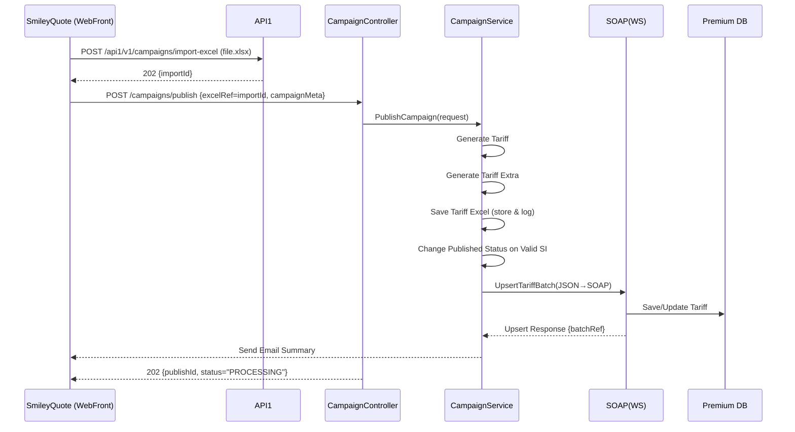

# สเปคการเชื่อมต่อระบบ (Markdown Spec) — **เวอร์ชัน 1.3.2 (SmileyQuote → API1 + HttpPost PublishCampaign + SOAP)**

> วันที่อัปเดต: 2026-03-18 • ผู้อัปเดต: M365 Copilot

**ความหมายตามที่ผู้ใช้งานยืนยัน**
- **WebFront (SmileyQuote)** เรียกใช้งานสองส่วน:
  1) เรียก **API1** (รวมความสามารถอ่าน/ตั้งค่าจาก Excel)
  2) เรียก **Method: HttpPost PublishCampaign** ภายใน **CampaignController**
- ภายใน **HttpPost PublishCampaign** จะเรียก **CampaignService** เพื่อทำขั้นตอนบริการ (services) ต่อไปนี้ตามลำดับ:
  1. Generate Tariff  
  2. Generate Tariff Extra  
  3. Save Tariff Excel  
  4. Change Published Status on Valid SI  
  5. Campaign To Premium *(สร้าง JSON แล้วเรียก SOAP(WS) เพื่อบันทึกเข้า Premium)*  
  6. Send Email *(แจ้งผล)*

---

## 1) ภาพรวมสถาปัตยกรรม (ตาม Flow 1.3.2)

```
SmileyQuote (WebFront)
   ├─► API1  ──► (อ่าน/ตั้งค่าจาก Excel) ──► SOAP(WS) ──► Premium DB
   └─► CampaignController.HttpPost PublishCampaign
            └─► CampaignService
                 ├─ Generate Tariff
                 ├─ Generate Tariff Extra
                 ├─ Save Tariff Excel
                 ├─ Change Published Status on Valid SI
                 ├─ Campaign To Premium ──► SOAP(WS) ──► Premium DB
                 └─ Send Email
```

---

## 2) Contracts & Endpoints

### 2.1 API1 (ภายนอก)
- **POST** `/api1/v1/campaigns/import-excel` — อัปโหลด Excel เพื่อเตรียมข้อมูล/ตั้งค่าก่อน publish  
  Headers: `Authorization`, `Content-Type: multipart/form-data`, `Idempotency-Key`  
  Response: `202 Accepted` พร้อม `importId`
- **GET** `/api1/v1/campaigns/imports/{importId}` — ตรวจสถานะผลการ parse/validate

> API1 อาจ **ไม่** ส่งเข้า Premium โดยตรง แต่เตรียมข้อมูลที่จำเป็นให้ฝั่ง Controller/Service ใช้ต่อ

### 2.2 CampaignController (ภายใน เรียกจาก WebFront)
- **POST** `/campaigns/publish` *(HttpPost PublishCampaign)*  
  Purpose: รับคำสั่งจาก SmileyQuote พร้อม metadata/ตัวชี้ไปยังไฟล์ Excel ที่ API1 จัดเก็บ จากนั้นเรียก **CampaignService**
  - Headers: `Authorization` (frontend token), `Correlation-Id`, ชุด field ที่จำเป็น
  - Request (ตัวอย่าง):
```json
{
  "campaignMeta": {
    "name": "Motor Summer 2026",
    "period": {"from": "2026-04-01", "to": "2026-06-30"},
    "channel": "WEB"
  },
  "excelRef": "IMP-1f2e3d4c-...",   
  "notifyEmails": ["ops@company.com", "pm@company.com"],
  "options": {"dryRun": false}
}
```
  - Response: `202 Accepted` (แนะนำ async) พร้อม `publishId`

### 2.3 CampaignService (ภายใน - Services)
- ไม่มี HTTP สาธารณะ แต่เปิดใช้ผ่าน Controller เท่านั้น  
- ขั้นตอนย่อยทำงานแบบ synchronous ต่อกันใน job เดียว หรือกระจายเป็นงานย่อยแบบ queue ตามปริมาณข้อมูล

### 2.4 SOAP (WS) — Premium
- ใช้เมธอด **UpsertTariffBatch / ActivateTariff / VerifyTariff** (ตัวอย่างชื่อ)  
- Security: HTTPS + Basic/OAuth/mTLS (ตามข้อกำหนดของ Premium)

---

## 3) ลำดับการทำงาน (Sequence)

### 3.1 เส้นทางการ Publish (WebFront → Controller → Service → SOAP)


---

## 4) ข้อมูลและสคีมา

### 4.1 Excel Schema (ยืนยันจาก v1.3)
**Sheet: Tariff**
```
TariffCode*, ProductCode*, Plan, Coverage, SI_Min*, SI_Max*, RateType*, RateValue*, EffectiveFrom*, EffectiveTo*, Channel, Remark
```
**Sheet: TariffExtra**
```
TariffCode*, ExtraType*, ExtraValue*, Condition, Remark
```

### 4.2 โมเดลภายในที่ Controller ส่งเข้า Service
```json
{
  "correlationId": "UUID",
  "campaignMeta": {"name": "Motor Summer 2026", "period": {"from": "2026-04-01", "to": "2026-06-30"}, "channel": "WEB"},
  "excelRef": "IMP-...",
  "parsed": {
    "tariffs": [
      {
        "tariffCode":"TAR-001","productCode":"AUTO_A","plan":"STD","coverage":"OD",
        "si":{"min":300000,"max":800000},
        "rate":{"type":"PERCENT","value":1.75},
        "effective":{"from":"2026-04-01","to":"2026-06-30"}
      }
    ],
    "extras": [{"tariffCode":"TAR-001","type":"DISCOUNT","value":5,"condition":"AGE>30"}]
  }
}
```

### 4.3 JSON → SOAP Mapping (ตัวอย่างสำคัญ)
| JSON (Service) | SOAP (Premium) |
|---|---|
| `tariffCode` | `TariffItem/TariffCode` |
| `productCode` | `TariffItem/ProductCode` |
| `plan` | `TariffItem/Plan` |
| `coverage` | `TariffItem/Coverage` |
| `si.min` | `TariffItem/SI_Min` |
| `si.max` | `TariffItem/SI_Max` |
| `rate.type` | `TariffItem/RateType` |
| `rate.value` | `TariffItem/RateValue` |
| `effective.from` | `TariffItem/EffectiveFrom` |
| `effective.to` | `TariffItem/EffectiveTo` |

### 4.4 ตัวอย่าง SOAP (ย่อ)
```xml
<soapenv:Envelope xmlns:soapenv="http://schemas.xmlsoap.org/soap/envelope/" xmlns:pre="http://premium.example.com/schema">
  <soapenv:Header/>
  <soapenv:Body>
    <pre:UpsertTariffBatchRequest>
      <pre:BatchRef>UUID</pre:BatchRef>
      <pre:CampaignName>Motor Summer 2026</pre:CampaignName>
      <pre:Items>
        <pre:TariffItem>
          <pre:TariffCode>TAR-001</pre:TariffCode>
          <pre:ProductCode>AUTO_A</pre:ProductCode>
          <pre:Plan>STD</pre:Plan>
          <pre:Coverage>OD</pre:Coverage>
          <pre:SI_Min>300000</pre:SI_Min>
          <pre:SI_Max>800000</pre:SI_Max>
          <pre:RateType>PERCENT</pre:RateType>
          <pre:RateValue>1.75</pre:RateValue>
          <pre:EffectiveFrom>2026-04-01</pre:EffectiveFrom>
          <pre:EffectiveTo>2026-06-30</pre:EffectiveTo>
        </pre:TariffItem>
      </pre:Items>
    </pre:UpsertTariffBatchRequest>
  </soapenv:Body>
</soapenv:Envelope>
```

---

## 5) Validation & Business Rules
- **SI Range**: `SI_Min < SI_Max`; ช่วงเวลา `EffectiveFrom ≤ EffectiveTo`
- **Overlap Check**: ไม่ให้ทับซ้อนกับ Tariff ที่มีอยู่ (key: `ProductCode+Plan+Coverage+SI range+dates`)
- **Extras**: ตรวจชนิดที่รองรับ (`DISCOUNT|LOADING|FEE`) และค่า `ExtraValue` เป็นตัวเลข > 0
- **Idempotency**: ใช้ `Idempotency-Key` ที่ API1 (ไฟล์) และ `publishId/batchRef` ที่ Controller/Service
- **Audit/Tracing**: `correlationId` เดียวกันตั้งแต่ WebFront → Controller → Service → SOAP

---

## 6) ความปลอดภัย/NFR
- TLS 1.2+ ทุกช่องทาง
- Auth: OAuth2 สำหรับ API1/Controller; mTLS หรือ Internal JWT ระหว่าง Controller ↔ Service; Auth ตามข้อกำหนดของ SOAP (Basic/OAuth/mTLS)
- Temp Storage: ไฟล์ Excel เข้ารหัส at-rest; เก็บ ≤ 24 ชม.
- Performance: Batch 5k–10k แถว ภายใน 10–20 นาที (async + chunk)
- Observability: Metrics (ผ่าน/ตกต่อแถว), structured log พร้อม masking PII

---

## 7) ตัวอย่างคำสั่ง (cURL)

### 7.1 อัปโหลด Excel ไป API1
```bash
curl -X POST https://api.company.com/api1/v1/campaigns/import-excel \
  -H "Authorization: Bearer $TOKEN" \
  -H "Idempotency-Key: $(uuidgen)" \
  -F "file=@campaign-tariff.xlsx"
```

### 7.2 สั่ง Publish จาก WebFront ไป Controller
```bash
curl -X POST https://app.company.com/campaigns/publish \
  -H "Authorization: Bearer $USER_TOKEN" \
  -H "Correlation-Id: $(uuidgen)" \
  -H "Content-Type: application/json" \
  -d '{
    "campaignMeta": {"name": "Motor Summer 2026", "period": {"from": "2026-04-01", "to": "2026-06-30"}, "channel": "WEB"},
    "excelRef": "IMP-123456",
    "notifyEmails": ["ops@company.com","pm@company.com"],
    "options": {"dryRun": false}
  }'
```

---

## 8) ภาคผนวก — Email Summary Template
```
Subject: [Campaign Publish] <CampaignName> — <Status>

สรุปผล (Publish ID: <publishId>)
- BatchRef: <UUID>
- Accepted: <n>
- Rejected: <n>
- Errors: แนบไฟล์ CSV (row, code, message)
- ตรวจสอบสถานะผ่านหน้า Monitor หรือ API1 imports
```

---

**หมายเหตุ**: เอกสารนี้ใช้ชื่อ path/เมธอดเป็นร่างเพื่อการสื่อสาร เทคโนโลยีและพารามิเตอร์ SOAP อาจแตกต่างตามระบบ Premium จริง กรุณายืนยันร่วมกับทีม Premium ก่อนขึ้นงานจริง
