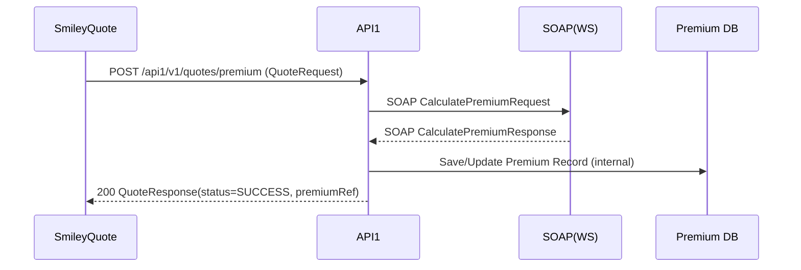
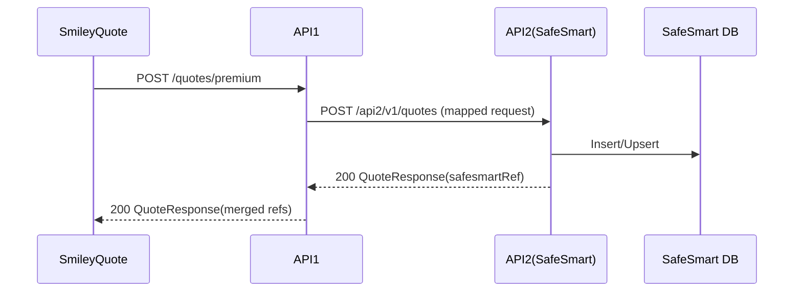
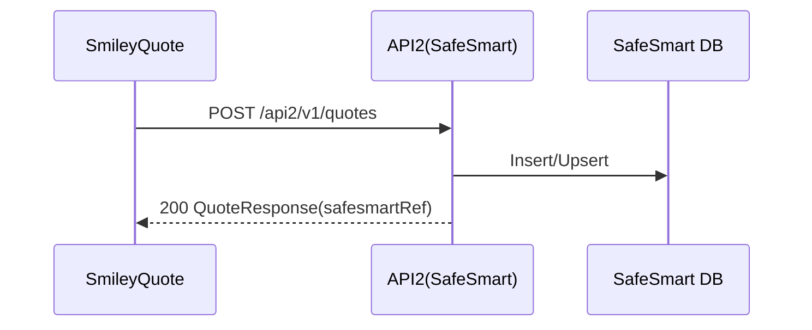

# สเปคการเชื่อมต่อระบบ (Markdown Spec)

> เวอร์ชัน: 1.0 • วันที่ออกร่าง: 2026-03-18

เอกสารฉบับนี้สรุปสถาปัตยกรรมการเชื่อมต่อระหว่างระบบจากแผนภาพโฟลว์ที่ให้มา ประกอบด้วย **SmileyQuote**, **API1**, **API2 (SafeSmart)**, **SOAP (WS)**, และคลังข้อมูล **Premium** และ **SafeSmart** พร้อมรายละเอียดเอ็นด์พอยต์ โครงสร้างข้อมูล ลำดับการทำงาน ข้อกำหนดด้านความปลอดภัย และแนวทางทดสอบ

---

## 1) ภาพรวมสถาปัตยกรรม

```
SmileyQuote ──► API1 ──► SOAP(WS) ──► Premium(DB)
     │            │                         ▲
     │            └────► API2(SafeSmart) ───┘
     └──────────────────► API2(SafeSmart) ──► SafeSmart(DB)
```

- **ทิศทางลูกศร** แสดงการเรียกใช้งานหลักจากต้นทางไปปลายทาง
- **API1** ทำหน้าที่ orchestration เรียก SOAP (WS) เพื่อบันทึก/อ่านข้อมูลจาก **Premium DB** และสามารถเรียก **API2** ในบางกรณี
- **SmileyQuote** สามารถเรียก **API1** และ **API2** โดยตรงตามกรณีการใช้งาน
- **API2 (SafeSmart)** บันทึกผลไปยัง **SafeSmart DB**

> หมายเหตุ: หากต้องการ QoS ที่รับประกันการส่งต่อ แนะนำรองรับ **retry + idempotency key** ที่ API1 และ API2

---

## 2) บทบาทของคอมโพเนนต์

| คอมโพเนนต์ | บทบาท | โปรโตคอล |
|---|---|---|
| SmileyQuote | ระบบต้นทางสำหรับทำใบเสนอราคา/ขอเบี้ยประกัน | HTTPS/REST |
| API1 | Service กลางสำหรับประกอบธุรกรรม เรียก SOAP ไปยัง Premium | HTTPS/REST → SOAP |
| SOAP (WS) | บริการแบบ Web Service สำหรับ Premium | SOAP 1.1/1.2 over HTTPS |
| Premium DB | ฐานข้อมูลเบี้ย/กรมธรรม์ | – |
| API2 (SafeSmart) | บริการสำหรับ SafeSmart (บันทึก/ดึงข้อมูลที่เกี่ยวข้อง) | HTTPS/REST |
| SafeSmart DB | ฐานข้อมูลของ SafeSmart | – |

---

## 3) แบบข้อมูลมาตรฐาน (Canonical Models)

> โครงสร้างตัวอย่างด้านล่างเป็นร่างเพื่อให้ทีมกำหนดชื่อฟิลด์จริงอีกครั้ง

### 3.1 QuoteRequest (จาก SmileyQuote → API1 หรือ API2)
```json
{
  "requestId": "UUID",
  "quoteNo": "string",
  "productCode": "string",
  "insured": {
    "fullName": "string",
    "dob": "YYYY-MM-DD",
    "nationalId": "string"
  },
  "vehicle": {
    "brand": "string",
    "model": "string",
    "year": 2022
  },
  "coverage": {
    "plan": "string",
    "sumInsured": 500000.0,
    "addons": ["PA", "Flood"]
  },
  "channel": "WEB|AGENT|API",
  "timestamp": "ISO-8601",
  "idempotencyKey": "UUID"
}
```

### 3.2 QuoteResponse (ตอบกลับจาก API1/API2)
```json
{
  "requestId": "UUID",
  "status": "SUCCESS|FAILED|PENDING",
  "premium": {
    "gross": 12000.50,
    "net": 11000.00,
    "tax": 770.50
  },
  "message": "string",
  "reference": {
    "premiumRef": "string",
    "safesmartRef": "string"
  }
}
```

### 3.3 Premium SOAP Payload (ตัวอย่าง SOAP Body ย่อ)
```xml
<soapenv:Envelope xmlns:soapenv="http://schemas.xmlsoap.org/soap/envelope/" xmlns:pre="http://premium.example.com/schema">
  <soapenv:Header/>
  <soapenv:Body>
    <pre:CalculatePremiumRequest>
      <pre:QuoteNo>string</pre:QuoteNo>
      <pre:ProductCode>string</pre:ProductCode>
      <pre:SumInsured>500000</pre:SumInsured>
      <!-- ... ฟิลด์อื่น ๆ ... -->
    </pre:CalculatePremiumRequest>
  </soapenv:Body>
</soapenv:Envelope>
```

---

## 4) สัญญา API (Draft)

> ระบุเป็นร่างเพื่อให้ทีมเจ้าของระบบยืนยัน path/ฟิลด์/รหัสสถานะ

### 4.1 API1
- **Base URL**: `https://api.company.com/api1/v1`
- **Security**: OAuth2 Client Credentials (scope: `premium:write premium:read`), `Idempotency-Key` header

#### 4.1.1 POST `/quotes/premium`
- **Purpose**: รับคำขอคำนวณเบี้ยจาก SmileyQuote → แปลง/เรียก SOAP → คืนผล และอาจเขียนอ้างอิงไป Premium DB
- **Request Headers**: `Authorization: Bearer <token>`, `Idempotency-Key: <uuid>`
- **Request Body**: `QuoteRequest`
- **Responses**:
  - `200`: `QuoteResponse` (status=SUCCESS)
  - `202`: `QuoteResponse` (status=PENDING) กรณีประมวลผล async
  - `400/401/403/409/422/429/500/502/504`: ตามกรณี พร้อม `errorCode`, `errorMessage`

#### 4.1.2 GET `/premium/{premiumRef}`
- **Purpose**: อ่านรายละเอียดเบี้ยจาก Premium DB ผ่านตัวกลาง
- **Response**: รายละเอียด premium (JSON)

### 4.2 API2 (SafeSmart)
- **Base URL**: `https://api.company.com/api2/v1`
- **Security**: OAuth2 Client Credentials (scope: `safesmart:write safesmart:read`), `Idempotency-Key`

#### 4.2.1 POST `/quotes`
- **Purpose**: บันทึกข้อมูลใบเสนอราคา/ผลเบี้ยลง SafeSmart DB
- **Request Body**: `QuoteRequest` + ฟิลด์เพิ่มเติมเฉพาะ SafeSmart (เช่น `agentCode`, `campaignId`)
- **Response**: `QuoteResponse` (มี `safesmartRef`)

#### 4.2.2 GET `/quotes/{safesmartRef}`
- **Purpose**: ดึงสถานะ/รายละเอียดจาก SafeSmart DB

---

## 5) ลำดับการทำงาน (Sequence)

### 5.1 เส้นทางหลัก: SmileyQuote → API1 → SOAP → Premium DB



### 5.2 เส้นทางเสริม: API1 → API2 (Sync/Async)



### 5.3 ทางตรง: SmileyQuote → API2 → SafeSmart DB



---

## 6) การแม็ปข้อมูล (Mapping ระดับสูง)

| จาก | ไป | ตัวอย่างการแม็ป |
|---|---|---|
| `QuoteRequest.productCode` | SOAP `ProductCode` | คงค่าเดิม |
| `coverage.sumInsured` | SOAP `SumInsured` | แปลงเป็น integer หากจำเป็น |
| `insured.dob` | SOAP `DOB` | แปลงรูปแบบ `YYYY-MM-DD` → ที่ SOAP รองรับ |
| `requestId` | Premium Ref / CorrelationId | ใช้ติดตามการทำรายการ |

> แนบ **Data Dictionary** ฉบับละเอียดในภาคผนวก A (ระบุข้อบังคับ, ความยาว, รูปแบบ regex)

---

## 7) ข้อกำหนดด้านความปลอดภัย
- **Transport**: บังคับใช้ TLS 1.2 ขึ้นไป
- **AuthN/AuthZ**: OAuth2 Client Credentials + scope ตามบริการ, ใช้ **mTLS** (ถ้าองค์กรกำหนด)
- **Idempotency**: รองรับ `Idempotency-Key` สำหรับคำสั่ง POST เพื่อป้องกันซ้ำซ้อน
- **PII Protection**: เข้ารหัสที่พักข้อมูล (at-rest) และปิดบังข้อมูลใน log (masking)
- **Audit**: เก็บ `requestId`, `idempotencyKey`, `clientId`, `timestamp`

---

## 8) การจัดการข้อผิดพลาด

รูปแบบข้อผิดพลาด (ตัวอย่าง):
```json
{
  "errorCode": "PREMIUM-WS-504",
  "errorMessage": "Premium service timeout",
  "correlationId": "UUID",
  "suggestion": "retry"
}
```

การแมปสถานะ:
- 400: Validation error
- 401/403: Authentication/Authorization
- 409: Duplicate (idempotency conflict)
- 422: Unprocessable (mapping/ธุรกิจ)
- 429: Rate limit
- 500/502/503/504: ระบบปลายทางหรือโครงสร้างพื้นฐาน

นโยบายรีทราย:
- Exponential backoff: 1s, 2s, 4s (สูงสุด 3 ครั้ง) สำหรับ 502/503/504/429

---

## 9) ไม่ใช่เชิงหน้าที่ (Non‑functional)
- **SLA** API1: P95 ≤ 800ms (ไม่รวม SOAP), Uptime ≥ 99.9%
- **SLA** API2: P95 ≤ 300ms, Uptime ≥ 99.9%
- **Throughput คาดการณ์**: 50 RPS เฉลี่ย, 150 RPS peak
- **Observability**: Metrics (latency, error rate), Tracing (W3C Trace Context), Centralized Logging

---

## 10) การทดสอบและตัวอย่าง

### 10.1 cURL ตัวอย่าง
```bash
# API1 - Calculate Premium
curl -X POST https://api.company.com/api1/v1/quotes/premium \
  -H "Authorization: Bearer $TOKEN" \
  -H "Content-Type: application/json" \
  -H "Idempotency-Key: $(uuidgen)" \
  -d '{
    "requestId":"11111111-1111-1111-1111-111111111111",
    "quoteNo":"Q24001",
    "productCode":"AUTO_A",
    "insured":{"fullName":"A B","dob":"1993-01-01","nationalId":"1234567890123"},
    "vehicle":{"brand":"Toyota","model":"Yaris","year":2022},
    "coverage":{"plan":"STD","sumInsured":500000,"addons":["PA"]},
    "channel":"WEB",
    "timestamp":"2026-03-18T03:49:00Z",
    "idempotencyKey":"22222222-2222-2222-2222-222222222222"
  }'
```

### 10.2 Test Cases (ย่อ)
- คำนวณเบี้ยสำเร็จ (200)
- Timeout SOAP (504) → รีทราย 3 ครั้ง → ส่งกลับ 504 พร้อมคำแนะนำ
- Idempotency ซ้ำ → 409
- Validation ผิดรูปแบบ (dob ไม่ถูกต้อง) → 400

---

## 11) การดีพลอยและเวอร์ชัน
- Versioning: URI version (`/v1`) + Semantic Versioning เอกสาร
- Environments: `DEV` → `UAT` → `PROD` (เปลี่ยน Base URL)
- Backward compatibility: หลีกเลี่ยง breaking changes; ใช้ฟิลด์ใหม่เป็น optional

---

## ภาคผนวก A: Data Dictionary (Template)

| ฟิลด์ | ประเภท | รูปแบบ/ข้อกำหนด | บังคับ |
|---|---|---|---|
| requestId | UUID | 36 ตัวอักษร | Yes |
| quoteNo | string | ≤ 20 | Yes |
| productCode | string | enum | Yes |
| insured.dob | date | `YYYY-MM-DD` | Yes |
| coverage.sumInsured | number | > 0 | Yes |
| idempotencyKey | UUID | ใช้สำหรับ POST | Yes |

> โปรดเติมเต็มรายละเอียดฟิลด์ตามระบบจริง

---

**ผู้ติดต่อ**: เจ้าของระบบ API1, API2 และทีม Premium/Soap (ระบุชื่อ/อีเมลในเอกสารฉบับโปรดักชัน)

