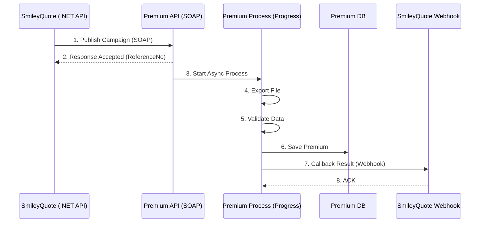
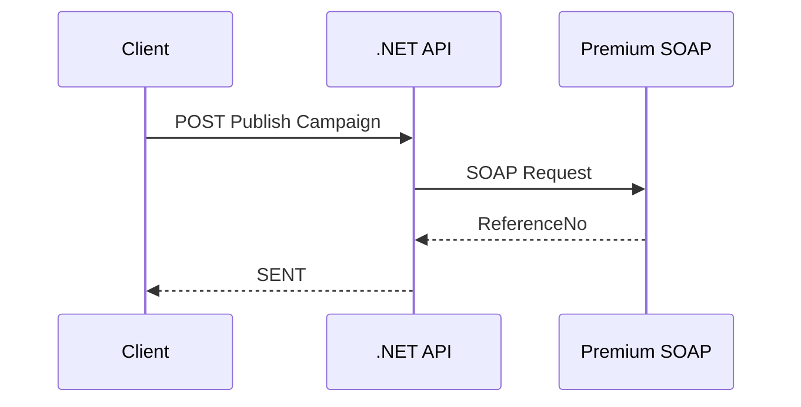
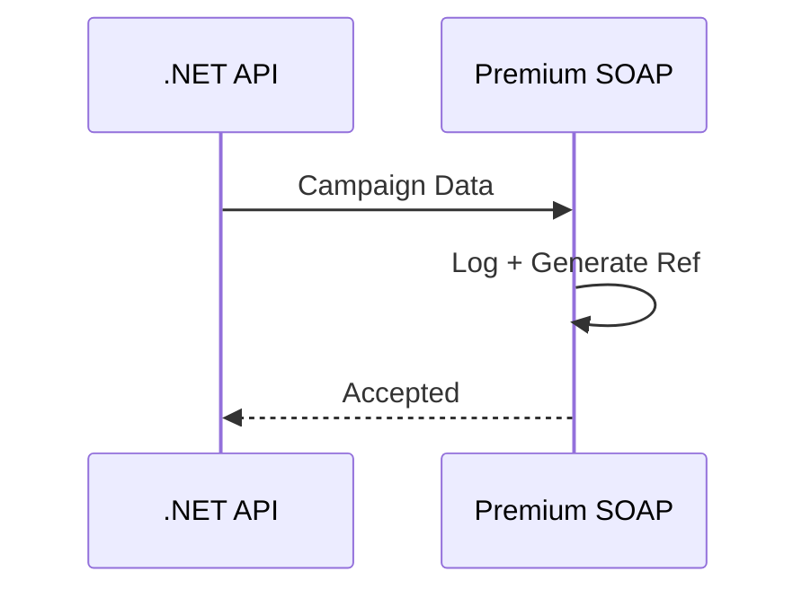
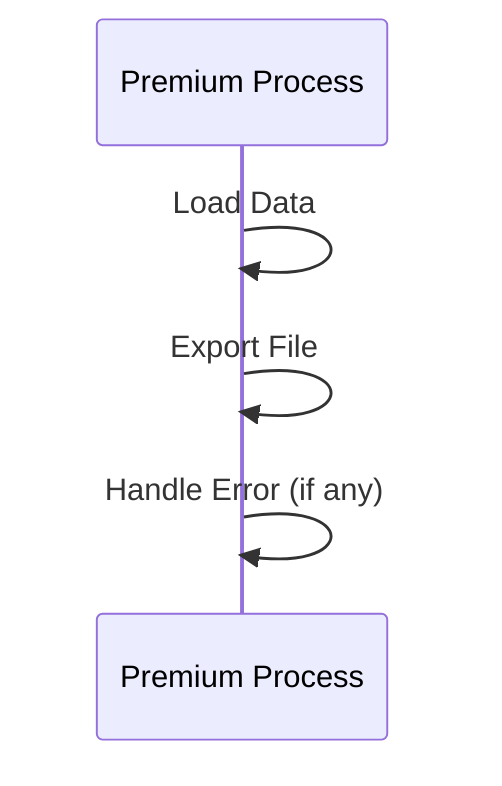
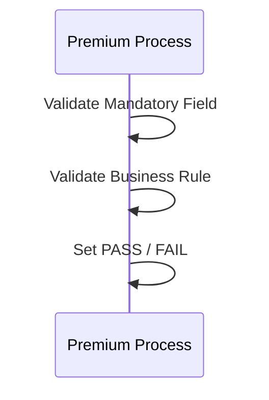
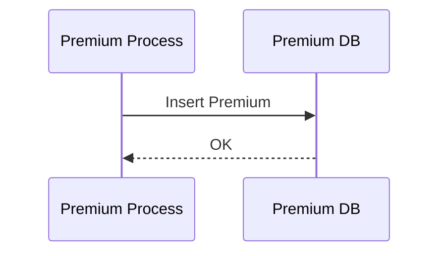
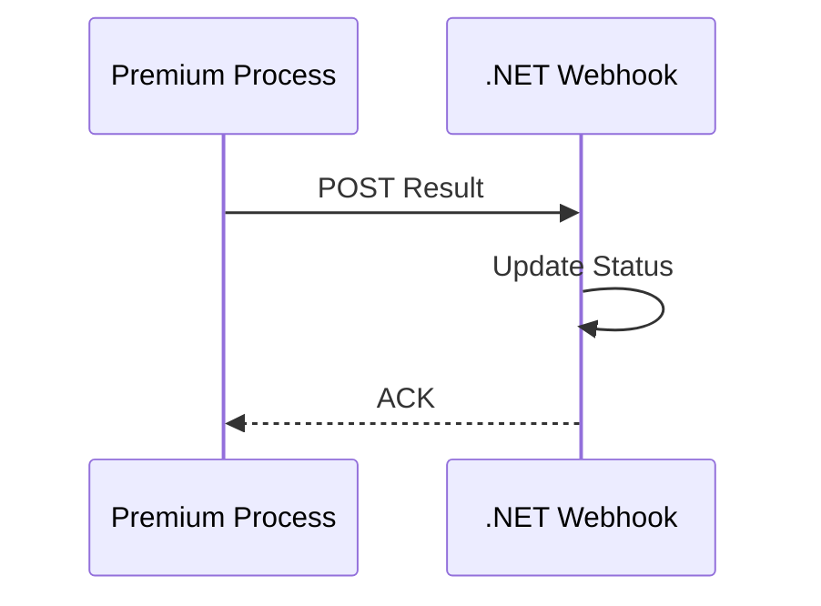

# SmileyQuote ↔ Premium Integration (Step-by-Step)

## 1. Overall Sequence Diagram

---

## 2. Process 1: Publish Campaign (.NET → Premium SOAP)

### Step-by-Step
1. Client เรียก `.NET API /api/publish/premium`
2. .NET Validate Request
3. .NET แปลงข้อมูลเป็น SOAP Payload
4. เรียก Premium SOAP Service
5. Premium Return ReferenceNo
6. .NET Save Status = SENT

### Mermaid

---

## 3. Process 2: Premium Receive & Accept

### Responsibility (Progress)
- Parse JSON / XML
- Generate ReferenceNo
- Save Incoming Log
- Return Accepted

### Mermaid

---

## 4. Process 3: Export File (Progress)

### Step-by-Step
1. Load Temp-Table
2. Map Data
3. Write File (CSV/XML)
4. If Error → Error File

### Mermaid

---

## 5. Process 4: Validate Process

### Validation Rules
- Mandatory Field
- Duplicate Check
- Business Rule

### Mermaid

---

## 6. Process 5: Save Premium Database

### Step-by-Step
1. Begin Transaction
2. Insert / Update Premium Table
3. Commit
4. On Error → Rollback

### Mermaid

---

## 7. Process 6: Callback Webhook (Progress → .NET)

### Step-by-Step
1. Prepare Result JSON
2. Add API Key Header
3. POST to Webhook
4. Wait ACK

### Mermaid

---

## 8. Status Mapping
| Step | Status |
|---|---|
| Publish | SENT |
| Processing | PROCESSING |
| Success | SUCCESS |
| Error | FAIL |

---

## 9. Key Design Notes
- SOAP = Accept & Return Quickly
- Process = Async Only
- Webhook = Idempotent (ReferenceNo)
- Logging ทุก Step

---

## End of Document
